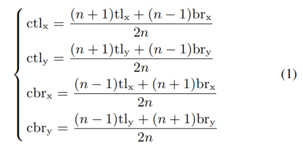

# CenterNet: Keypoint Triplets for Object Detection

**paper:** [centerNet](https://arxiv.org/abs/1904.08189) `CVPR2019`

**github:** [github](https://github.com/Duankaiwen/CenterNet)

## Abstract
In object detection, keypoint-based approaches often suffer a large number of incorrect object bounding boxes, arguably due to the lack of an additional look into the cropped regions. This paper presents an efficient solution which explores the visual patterns within each cropped region with minimal costs. We build our framework upon a representative one-stage keypoint-based detector named CornerNet. Our approach, named CenterNet, detects each object as a triplet, rather than a pair, of keypoints, which improves both precision and recall. Accordingly, we design two customized modules named cascade corner pooling and center pooling, which play the roles of enriching information collected by both top-left and bottom-right corners and providing more recognizable information at the central regions, respectively. On the MS-COCO dataset, CenterNet achieves an AP of 47.0%, which outperforms all existing one-stage detectors by at least 4.9%. Meanwhile, with a faster inference speed, CenterNet demonstrates quite comparable performance to the top-ranked two-stage detectors.

在对象检测中，基于关键点的检测方法通常面临大量的不正确的对象边界框，可能是由于缺乏看向裁剪区域的原因。这篇论文中提出了一个有效的解决方法，以最小的成本探索每个裁剪区域内的视觉模式。我们基于具有代表的一阶段基于关键点的检测器的CornerNet来构建我们的结构。我们的方法叫做CenterNet，检测的每一个对象为三元组（左上角、右下角、中心点），而不是一对关键点（左上角、右下角），它可以提高精度和召回率。我们设计两个自定义模块叫做cascade corner pooling和center pooling，他们的作用是丰富通过左上角点和右下角点收集的信息，并且提供中心区域更加可识别的信息。在COCO数据集上，CenterNet实现了47%的精度，超过已有的一阶段检测器至少4.9%。同时，它的检测速度很快，centerNet证明几乎可以与排名靠前的二阶段检测器相媲美。

## Introduction

anchor-based:
- 需要大量的anchors来保证高的IOU比率
- anchor的大小、长宽比需要手动设置
- anchor通常与ground truth没有对齐，不利于边界框的分类任务

所以有人提出keypoint-based的对象检测方法[CornerNet](https://github.com/hbkooo/PaperTest/edit/master/HBK/cornerNet)：
- 检测一对左上角和右下角的关键点，抛弃了anchor的使用
- 因为获取对象的全局信息的能力较弱，所以能力受到限制
- 算法对检测的对象边界框很敏感
- 不能很好的意识到哪组关键点（左上角点和右下角点）被划分到一个对象中，可能会生成错误的边界框

提出CenterNet，探索proposal的中心部分。在预测的时候生成一对关键角点（左上和右下）的proposal之后，我们通过判断相同类别的中心点是否落在proposal的中心区域来确定这个proposal是否为一个边界框。
- 提出center pooling，丰富中心关键点信息，用在支路中预测中心关键点
- 提出cascade corner pooling，带有原始的corner pooling模块并且能够感知内部的信息

## Approach
center keypoints procedure：
- 得到CornerNet中的角点的heatmap（两张，左上角点和右下角点）和embedding（判断两个角点是否属于同一个对象）和每个角点的offset（offset用来将角点remap到输入图像上），根据得分大小分别选择前k个角点，利用距离判断角点是否为同一个对象，最终得到对象的边界框。
- 得到中心关键点的heatmap和offsets
- 根据得分大小选择前k个中心关键点
- 使用中心关键点坐标偏移将这些中心关键点remap到输入图像上
- 为每个边界框定义中心区域，检查中心区域是否包含中心点。（注意：被检查的中心点的类别必须与边界框的类别一致）
- 如果中心关键点检测到在中心区域内，则保留这个边界框（如果中心区域没有关键点，则将这个边界框移除）
- 最终边界框的得分是三个点的得分的平均值（左上角点、中心点、右下角点）

所以中心区域的大小就会影响边界框的检测结果。较小的中心区域会导致较低的召回率例如小的边界框，而较大的中心区域对大的边界框会导致较低的精度，因此提出了一个中心区域尺度自适应的方法来适应不同大小的边界框，为小的边界框生成相对较大的中心区域，而为大的边界框生成相对较小的中心区域。

自适应的中心区域满足的等式如下图：其中tlx、tly是边界框的左上角点，brx、bry是边界框的右下角点，ctlx、ctly是中心区域的左上角点，cbrx、cbry是中心区域的右下角点，n是中心区域缩放的尺度。论文中如果边界框小于150则设置为3，反之设置为5。

## Center Pooling
对象的中心坐标并不包含有效地可视模式，例如人的头包含很强的可视模式，但是关键点只是身体的中间的一点。为了解决这个问题，提出center pooling来获取更加丰富的可识别的视觉模式，如图4（a）：
- 主干输出一张特征图
- 判断特征图上的一个点是否为中心关键点，我们找到水平方向和垂直方向上的最大值并把它们加在一起
- 通过这个方法，center pooling获取更好的中心关键点

## Cascade corner pooling
角通常在对象的外面，缺乏局部的外部特征。而[CornerNet](https://github.com/hbkooo/PaperTest/edit/master/HBK/cornerNet)使用corner pooling来解决这个问题。
**corner pooling如图4（b）:**
- 致力于寻找边界方向上的最大值和最小值，来得到角点
- 这使得角点对边缘很敏感

为了解决这个问题，我们需要让角看得见对象的视觉模式，提出**cascade corner pooling如图4（c）：**
- 首先看向边界，寻找边界的最大值
- 然后看向依靠着边界最大值的位置的内部来找到内部的最大值
- 最后将这两个最大值加在一起（以此给角点特征提供更加丰富的关联物体语义信息）
- 通过这样，角点就包含了边界的信息和对象的视觉模式

center pooling和cascade corner pooling都可以通过结合不同方向的corner pooling来容易实现如图5。
- center pooling,为了得到方向上的最大值，例如水平方向，我们只需要将左池化和右池化连续地连接起来。垂直方向也是同理
- cascade corner pooling，例如上角池化模块，相比于cornerNet的top corner pooling，这里在上角池化之前加入了左脚池化。

## Train

## Result

