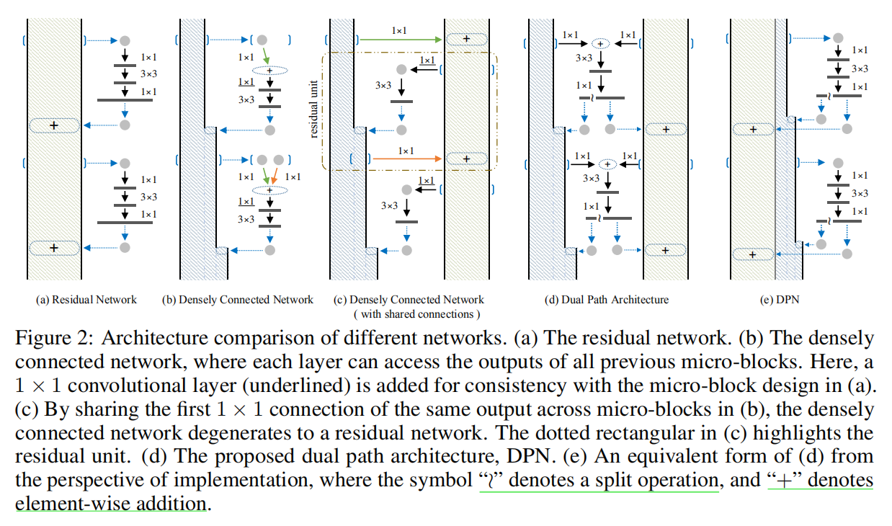
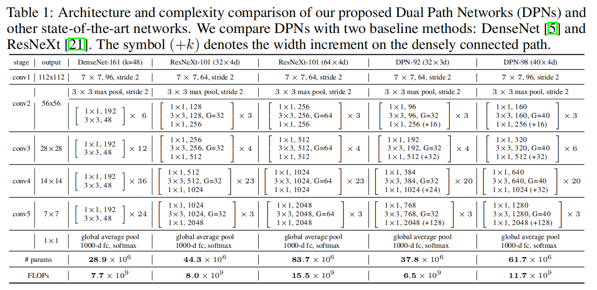
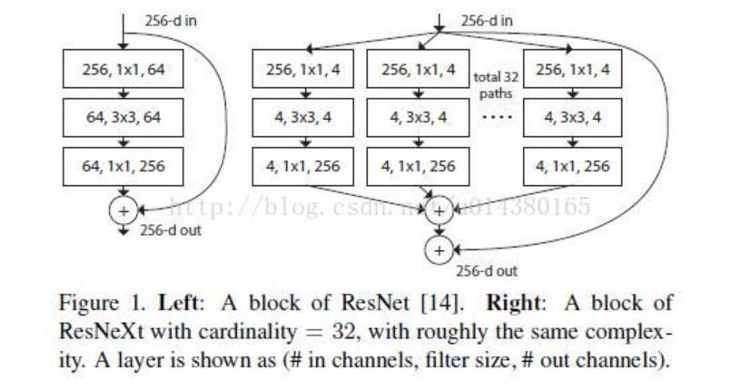
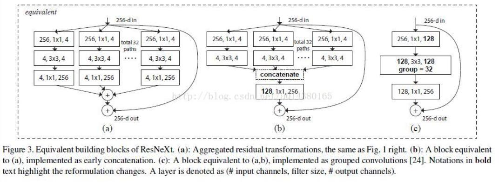
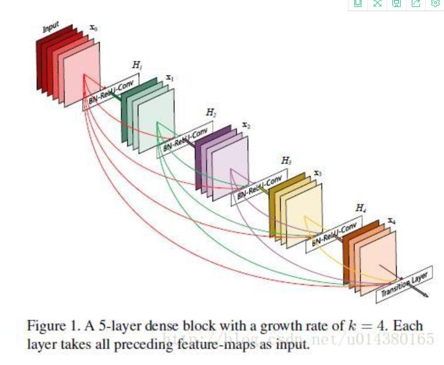

# Dual Path Networks
**paper:**[dpn](https://arxiv.org/abs/1707.01629) `CVPR2017`

**论文解读：**[解读](https://blog.csdn.net/u014380165/article/details/75676216)

## Abstract
In this work, we present a simple, highly efficient and modularized Dual Path Network (DPN) for image classification which presents a new topology of connection paths internally. By revealing the equivalence of the state-of-the-art Residual Network (ResNet) and Densely Convolutional Network (DenseNet) within the HORNN framework, we find that ResNet enables feature re-usage while DenseNet enables new features exploration which are both important for learning good representations. To enjoy the benefits from both path topologies, our proposed Dual Path Network shares common features while maintaining the flexibility to explore new features through dual path architectures. Extensive experiments on three benchmark datasets, ImagNet-1k, Places365 and PASCAL VOC, clearly demonstrate superior performance of the proposed DPN over state-of-the-arts. In particular, on the ImagNet-1k dataset, a shallow DPN surpasses the best ResNeXt-101(64x4d) with 26% smaller model size, 25% less computational cost and 8% lower memory consumption, and a deeper DPN (DPN-131) further pushes the state-of-the-art single model performance with about 2 times faster training speed. Experiments on the Places365 large-scale scene dataset, PASCAL VOC detection dataset, and PASCAL VOC segmentation dataset also demonstrate its consistently better performance than DenseNet, ResNet and the latest ResNeXt model over various applications.

## Contribute

综合利用了ResNeXt和DenseNet的结构：

### ResNeXt

### DenseNet

