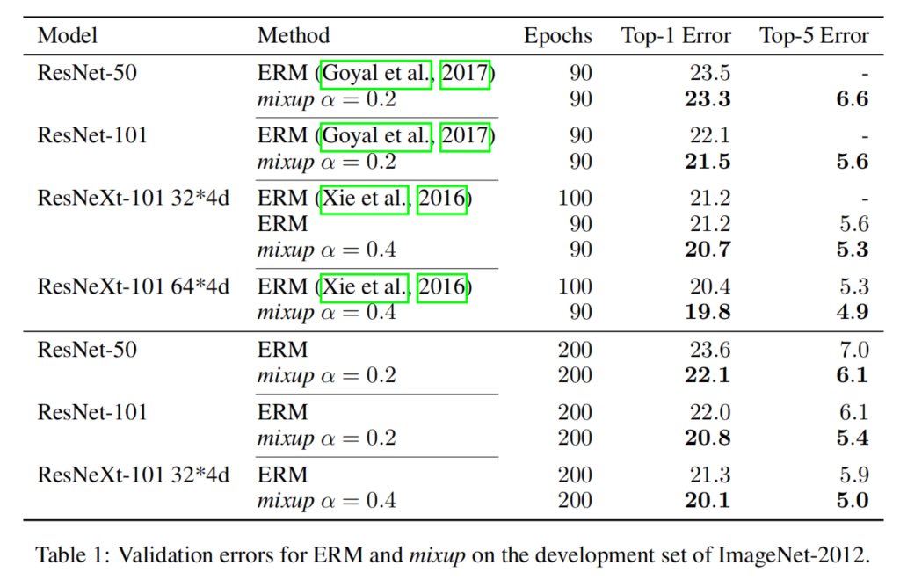

# mixup: BEYOND EMPIRICAL RISK MINIMIZATION

**paper:**[mixup](https://arxiv.org/abs/1710.09412)`CVPR2017`

**笔记:**[笔记](https://blog.csdn.net/u013859301/article/details/80098428)
[笔记2](https://www.cnblogs.com/hizhaolei/p/10611141.html)

## Abstract
Large deep neural networks are powerful, but exhibit undesirable behaviors such as memorization and sensitivity to adversarial examples. In this work, we propose mixup, a simple learning principle to alleviate these issues. In essence, mixup trains a neural network on convex combinations of pairs of examples and their labels. By doing so, mixup regularizes the neural network to favor simple linear behavior in-between training examples. Our experiments on the ImageNet-2012, CIFAR-10, CIFAR-100, Google commands and UCI datasets show that mixup improves the generalization of state-of-the-art neural network architectures. We also find that mixup reduces the memorization of corrupt labels, increases the robustness to adversarial examples, and stabilizes the training of generative adversarial networks.

大型深度神经网络功能强大，但也表现出不良行为，如记忆和对抗性例子的敏感性。在本文工作中，提出了mixup，一个简单的学习方法来解决这个问题。从本质上讲，mixup训练神经网络对成对示例及其标签的凸组合。通过这样做，mixup使神经网络正规化，有利于训练实例之间的简单线性行为。

## Introduction
最小化经验风险，Empirical Risk Minimization（ERM）：
- ERM允许大型神经网络记忆（而不是概括）训练数据，即使存在强正则化，或者在随机分配标签的分类问题中。 
- 另一方面，使用ERM训练的神经网络在对训练分布之外的实例（也称为对抗性实例）进行评估时会大幅改变其预测。
该证据表明，ERM无法解释或提供与训练数据略有不同的测试分布的概括，即是不利于泛化。

最小化邻近风险，Vicinal Risk Mnimization（VRM）
目前的data augmentation有两个毛病：①生成的相似样本是属于同一类的（文中描述为data augmentation assumes that the examples in the vicinity share the same class）；②不同类的样本之间的关系没有被建模。

**最初的ERM是没有数据增强的，对训练样本完全信赖，并且尽可能拟合之，这就是ERM principle，可是会带来过拟合，显而易见。VRM是产生近邻virtual sample，也就是做了data augmentation，由此一定程度缓解了过拟合，但是也只是一定程度上，因为仍然是ERM原则，因此还是会有过拟合。同时还存在一些其他问题：生成的virtual sample是通过某一个training sample产生的，并且和该training sample共享同一标签，也就是没有不同类、不同training sample之间的互动。由此引出了一种更好的data augmentation方法，也就是通过mixup的方式来产生virtual sample。**

## Contribution

mixup是一种新的数据扩充方式，生成虚拟的训练样本，它的计算公式如上图，mixup通过结合先前的知识来扩展训练分布，即特征向量的线性插值应该导致相关目标的线性插值。实现不同类之间的混合扩充。
- 它现简单，只需要几行代码，而且计算量也不大。并且在CIFAR-10、CIFAR-100、ImageNet-2012等图像分类数据集上能够实现最好的表现力。
- 当从错误标签中学习或者面临对抗样本的时候，mixup能够增加神经网络的鲁棒性。
- mixup能够改进语音、扁平数据的普遍化（generalization），并且能够用来稳固GANS网络的训练。

## FROM EMPIRICAL RISK MINIMIZATION TO mixup

如果样本（x,y）~P，即特征向量 X 和目标向量 Y 满足联合分布P(X, Y)，那么期望风险就是所有(X, Y)的Loss function对P(X, Y)的积分。
即 **R(f) = ∫ L(f(x),y) dP(x,y)**
不幸的是，期望风险是可望而不可即的，只能用经验风险代替。由于各种场景的测试数据的联合分布P是不可知的，只能使用训练数据的分布代替，称为经验分布。
即 **Pδ（x,y）= 1/n Σ(i=1,n)δ(x=xi,y=yi)**

其中是使用以各个样本点为中心的Dirac function的平均来计算。那么经验风险所有样本的Loss对经验分布的积分，也即所有样本的Loss直接求平均。对经验风险进行优化，就是ERM（Empirical Risk Minimization）。
为了实现ERM，就要对每一个样本降Loss，因此模型会尽力拟合尽可能多的样本，作者称之为“Memorize”，这和“Generalize”相对。由此导致了训练出来的X与Y之间的映射f在training data之外的表现不好。

为了解决ERM中的过拟合，出现了近邻风险最小化Vicinal Risk Minimization (VRM)，即数据扩充。VRM的分布P如下图。

其中v是近邻分布，即在(xi,yi)附近找到(x~,y~)的概率。   等价于在原始数据上加上高斯噪声。为了使用VRM，这篇文章首先基于临近分布采样出一个增强的数据集Dν:=(x~i,y~i)mi=1,并且在这个数据集上最小化经验-邻近风险Rv。

这篇文章提出了一般的近邻分布，称作mixup，见上图。

- 我们也考虑过三个或者三个以上的标签做混合，但是效果几乎和两个一样，而且增加了mixup过程的时间。
- 当前的mixup使用了一个单一的loader获取minibatch，对其随机打乱后，mixup对同一个minibatch内的数据做混合。这样的策略和在整个数据集随机打乱效果是一样的，而且还减少了IO的开销。
- 在同种标签的数据中使用mixup不会造成结果的显著增强。

所以mixup到底做了什么事情呢？其实就是告诉训练器，尽可能训练出线性的边界来。这样就会减少过拟合了。而且线性模型最简单，符合奥卡姆剃刀。图1 b显示了决策边界从一个类到另一个类线性过渡，从而提供更平滑的不确定性估计。图2评估了他们在CIFAR-10训练过程的i凹陷。可以看出mixup更加稳定一些。

## Experiments

在ImageNet-2012上的测试结果如上图所示，可以看出检测结果mixup的效果都比ERM效果要好。

