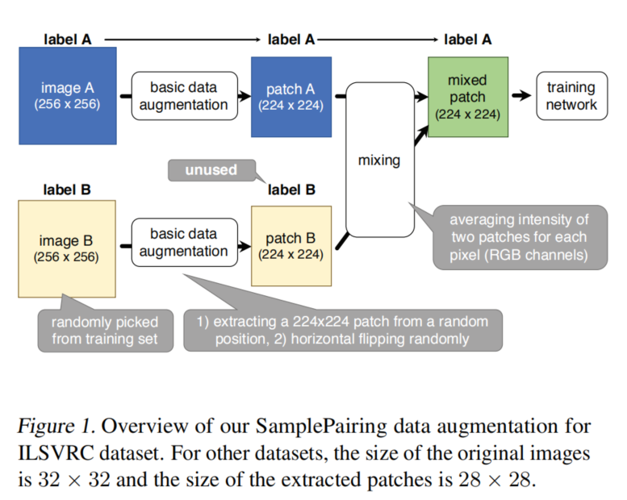
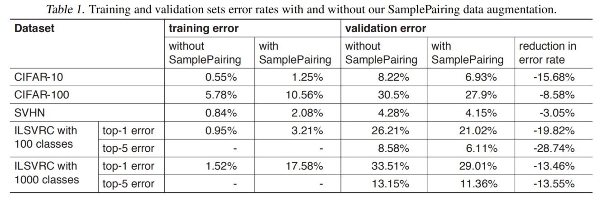
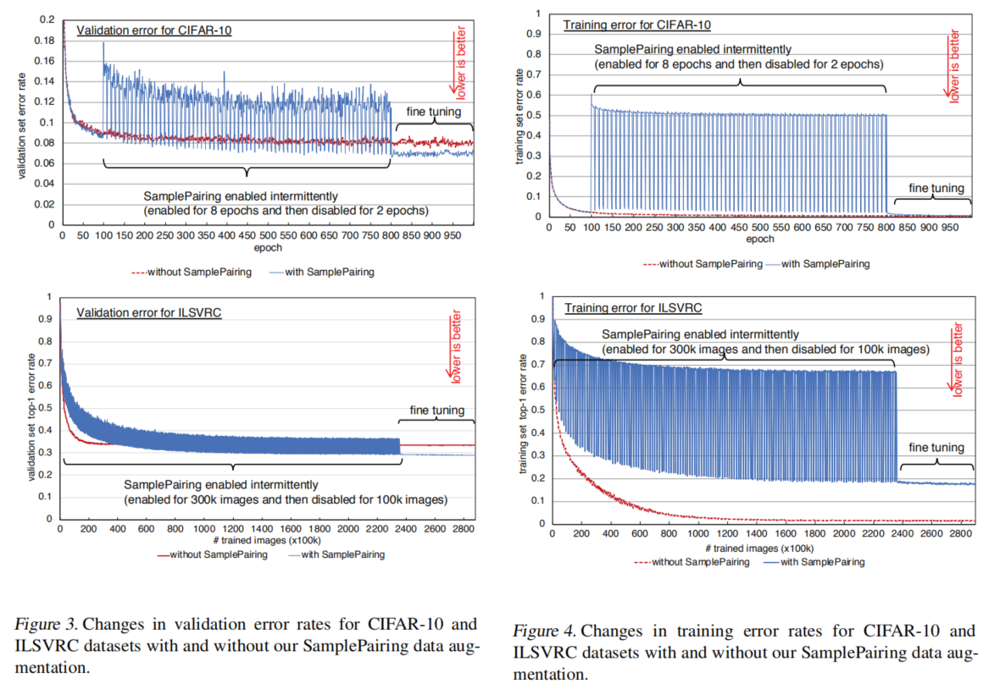
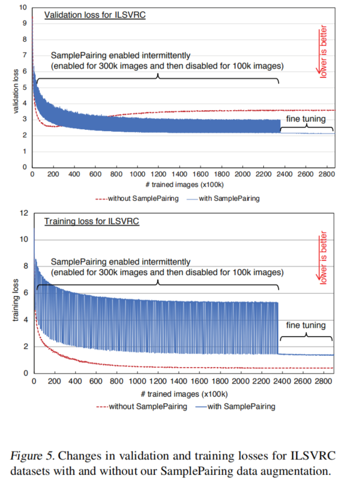
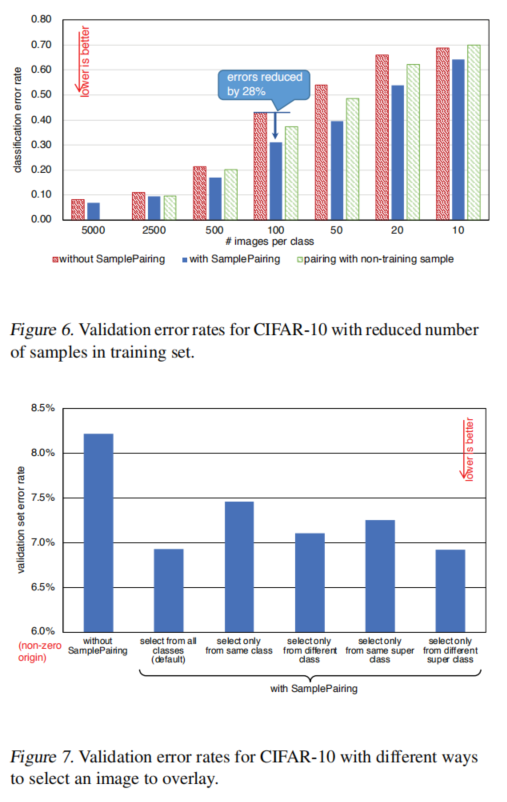
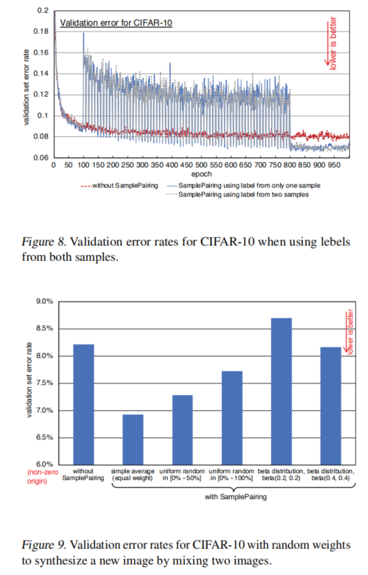
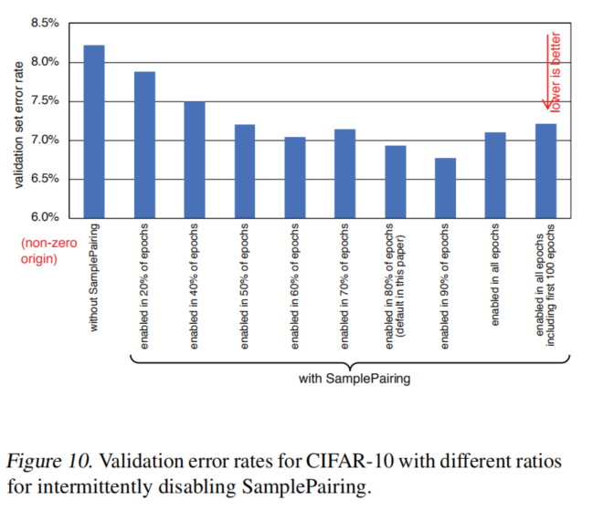

# Data Augmentation by Pairing Samples for Images Classification
**paper:**[samplePairing](https://arxiv.org/abs/1801.02929) `CVPR2018`

**笔记：**[笔记](https://blog.csdn.net/q295684174/article/details/79092096)

## Abstract
Data augmentation is a widely used technique in many machine learning tasks, such as image classification, to virtually enlarge the training dataset size and avoid overfitting. Traditional data augmentation techniques for image classification tasks create new samples from the original training data by, for example, flipping, distorting, adding a small amount of noise to, or cropping a patch from an original image. In this paper, we introduce a simple but surprisingly effective data augmentation technique for image classification tasks. With our technique, named SamplePairing, we synthesize a new sample from one image by overlaying another image randomly chosen from the training data (i.e., taking an average of two images for each pixel). By using two images randomly selected from the training set, we can generate N2 new samples from N training samples. This simple data augmentation technique significantly improved classification accuracy for all the tested datasets; for example, the top-1 error rate was reduced from 33.5% to 29.0% for the ILSVRC 2012 dataset with GoogLeNet and from 8.22% to 6.93% in the CIFAR-10 dataset. We also show that our SamplePairing technique largely improved accuracy when the number of samples in the training set was very small. Therefore, our technique is more valuable for tasks with a limited amount of training data, such as medical imaging tasks.

## Introduction
1、we create a new sample from one image by overlaying another image randomly picked from the training data。从训练数据集中随机挑选出一张图片覆盖到另一张图片上从而得到一个新的样本（例如对两张图片的每一个像素简单取平均值）。通过从训练集中随机挑选两张图片，这样我们就可以从只有N个训练样本的数据集中得到N^2个新的样本。

2、深入研究了如何选择覆盖图像影响训练网络的准确性。例如覆盖从训练集之外挑选的图片进行数据扩充，这种方法也会有一些提高；不过我们的方法使用从训练集中挑选图片进行覆盖从而进行数据扩充，这样改进效果更好。如果仅仅从相同或者相似类别的图像中挑选图片进行覆盖，这种情况下相比于从整个训练集中随机挑选而不加限制，精度会有所退化。

3、例如在CIFAR-10数据集中，为了表明在很小的训练集中这个方法可以取得很好的效果，我们减少CIFAR-10的数据数量，每种类别仅仅使用100个样例（所以一共有1000个样例），使用本文的数据扩充方法，分类的错误率从43.1%降低到了31%。这个结果表明我们的方法对那些训练集很少的任务很有作用。

## Related work
当在较小的训练集上训练模型时，训练的模型可能会过拟合训练集样本，从而泛化能力很差。数据扩充就用来解决这个问题。
Alexnet论文中方法：①从原始的256×256的图像中随机裁剪224×224的区域；②水平拉伸裁剪提取的区域；③改变RGB通道的亮度。可以增加2048倍的数据集。
本文SamplePairing：创造一对图像，从原始的N张样例中给出N×N个样例。本文的方法和其他的数据扩充技术是正交的。

避免过拟合除了数据扩充外还有其他方法：Dropout和its variants（在训练时随机消除连接（disabling connections））、Batch normalization（旨在解决内部协变量偏移的问题）。本文的SamplePairing数据扩充方法对这些技术也是正交的。

本方法是从两张图片中合成得到一个新的样例。SMOTE也是将两个样例图片合成一个新的样例，SMOTE对少数类进行过度抽样合成新的样例。而本文的方法在整个数据集上进行配对而不是仅仅对少数类。也有的利用卷积网络从而生成新的样例。也有的随机权重合成两个样本与本文的方法类似。

本文的方法和其他方法的不同：（1）其他方法也覆盖样本的标签，而本文的方法只使用一个样本的标签；（2）别人的方法使用随机的权重来覆盖两个样本，而本文的方法是平均覆盖两个样本，即样本的权重相同。
使用一个样本的标签比混合两个标签更简单，也适用于半监督设置。

## Method - Data Augmentation

basic idea：从在训练集中随机挑选的两个图像合成新图像，如在一些现有技术中所做的那样。为了生成新图像，使用最原始的方法将两个图像的像素求平均。

对于每一个训练epoch，所有的训练样例都以随机的次序送进网络中。对于本文的方法，从训练集中随机挑选另一张图片（图1中的图片B），求这两张图片的平均，然后将混合后的图片送进网络中，这个混合后的图片的标签是第一张图片的标签。第二章图片的标签没有使用，这与mixup和Between-class learning方法不同。

因为两张图片相同权重地合成一张图片，所以分类器不能正确预测第一张图片的标签（图1中的图片A），除非这两张图片的标签一样。所以训练损失不可能为0即使使用大型的网络，而且训练精度平均不会超过50%。对于N类别的分类，训练精度最大是 0.5 + 1/(N×2), 如果在训练集中所有类别都有相同数目的样本。
尽管使用samplePairing训练精度不高，但是当训练的最后微调阶段我们停止使用samplePairing时训练精度和验证精度会快速提高。在微调之后，使用samplePairing训练的网络比不使用该方法的网络检测精度更高。即使在微调之后使用samplePairing训练错误率和训练损失都比不使用该方法的大，因为samplePairing是一个强的regularizer。

在将两张图片合成最后的图片之前，也可以使用其他的数据扩充方法，然后再使用本文的方法。数据扩充的方法会增加额外的时间来准备输入图像，但是这可以在CPU上进行，而GPU用来进行训练的反向传递。所以在CPU上增加的额外运行时间不会明显地增加一张图片的全部训练时间。
整个训练过程如下：
- 先不使用SamplePairing的数据扩车方法来训练网络，但是可以使用传统的数据扩充方法，比如随机翻转、随机裁剪
- 在不使用SamplePairing完成一个epoch（对于ILSVRC数据集）或者100个epochs（其他数据集）后，开始使用SamplePairing数据扩充
- 在这个阶段，我们间隔性地停止使用SamplePairing。比如对于ILSVRC，我们先使用SamplePairing训练300000张图片，然后后面的100000张图片不使用SamplePairing数据扩充；对于其他数据集8个epochs使用SamplePairing，后面的2个epochs不使用SamplePairing
- 在训练损失和精度在训练阶段变得非常稳定的时候完成训练，我们不再使用SamplePairing然后进行微调

## Experiments

图三图四中，因为训练的时候samplePairing间隔使用，所以训练的错误率和验证的错误率波动都很大。当网络使用samplePairing训练的时候验证的错误率和训练的错误率都特别差。尤其训练的时候错误率居然达到了50%。理论上10类别的分类任务最好的错误率是45%。即使在微调之后，使用samplePairing训练的网络相比于不使用samplePairing方法，CIFAR-10数据集训练错误率两倍高，ILSVRC数据集错误率有10倍高。但是对于验证集错误率却变得很低。

图5中的损失和训练、验证错误率匹配。使用samplePairing增加了最终的训练损失，但是减少了验证损失。不使用samplePairing，在早期阶段我们能够得到最小的验证损失，但是过了这个最小点之后训练和验证损失都逐渐增加。而使用samplePairing并没有任何的验证损失的增加。

图6中，当训练集较少时，给出了分类的错误率。从图中可以看出当每类有100张样例时使用samplePairing方法能够获得最大的收益，错误率减少了28%；而且在每类使用50张样例时，使用samplePairing方法的错误率比使用100张样例而不使用samplePairing方法的错误率都要低。
另外做了另一种方式：随机选择图像进行覆盖时，随机选择的图像集不在训练集中。例如只是用100张图像进行训练，然后从剩余的4900张图像中再随机挑选100张图像作为候选的图像池用来挑选图片在原来的100张图像上进行覆盖。结果如图6中的”pairing with non-training sample，可以看到这种方法也会降低错误率，但是本文的samplePairing方法容易实现并且可以取得更大的改进。

图7中。在CIFAR-10上用下面5中方法来评估选择图片进行覆盖的方法的影响：
- A：从所有的训练集中随机挑选（默认）
- B：从与第一张图片相同类别的图片中随机挑选
- C：从不同的类别中随机挑选
- D：从相同的父类（super class）中随机挑选
- E：从不同的父类（super class）中随机挑选
对于CIFAR-10，我们定义了两个父类：①交通工具对象（飞机、摩托车、船、卡车）；②有生命的对象（鸟、猫、鹿、狗、青蛙、马）。
例如：如果假设第一张图片类别为0，父类为（0-3），则上面5中方法对应的覆盖策略是：
- A：从0-9类别中选
- B：从0类别中选
- C：从1-9类别中选
- D：从0-3类别中选
- E：从4-9类别中选
从图7中可以看出，当选择相同类别的图像进行覆盖时（方法B），改进的效果不如对所有类别中挑选。有趣的是，只有方法E，选择不同的父类进行覆盖时，实现的效果与从所有类别中选择相当。

从图8中，给出了对比的验证机错误率，不使用samplePairing、使用samplePairing时标签只是用一个样例、标签使用两个样例。从图中的结果可以看出，使用一个标签和两个标签之间的差别不是很大，所以只是用一个标签是一个合理地选择方便实现而且效果良好。

与mixup 或者 Between-class learning方法不同之处在于，我们的方法使用相同的权重混合两个样例，而另外两种方法使用随机的权重。mixup使用随机的贡献；Between-class learning使用统一的贡献。图9中给出了不同的混合比例方法，图中可以看出平均混合的方法效果最好。

图10描述了使用samplePairing或者不使用它的不同间隔比例下的最终的分类错误率。

## Conclusion
提出的samplePairing一种新的数据扩充的方法，很容易实现，在将图片送入网络训练之前仅仅将它们随机混合。而且，这种简单的方法在分类精度方面通过避免过拟合取得了很大的改进，尤其是当训练集的样本收到限制时。
本文中没有对这种方法能够改进的原因做出理论的证明，只是凭经验来讨论。

