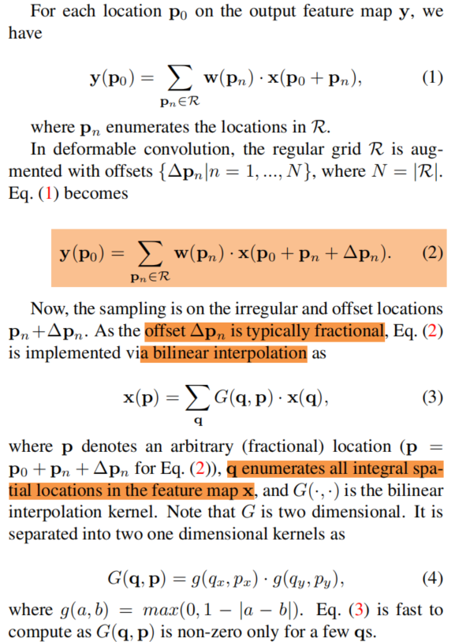
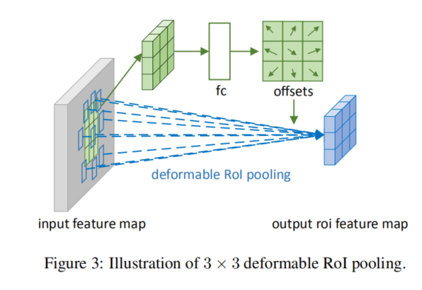

# Deformable Convolutional Networks
**paper:**[Deformable Convolutional Networks](https://arxiv.org/abs/1703.06211)

## Abstract
Convolutional neural networks (CNNs) are inherently limited to model geometric transformations due to the fixed geometric structures in its building modules. In this work, we introduce two new modules to enhance the transformation modeling capacity of CNNs, namely, deformable convolution and deformable RoI pooling. Both are based on the idea of augmenting the spatial sampling locations in the modules with additional offsets and learning the offsets from target tasks, without additional supervision. The new modules can readily replace their plain counterparts in existing CNNs and can be easily trained end-to-end by standard back-propagation, giving rise to deformable convolutional networks. Extensive experiments validate the effectiveness of our approach on sophisticated vision tasks of object detection and semantic segmentation. The code would be released.

本文主要提出两个新的模块来增强CNN的转型建模能力：可变形卷积和可变形RoI池化。两者都基于这样的想法：增加模块中的空间采样位置以及额外的偏移并学习目标任务的偏移，而无需额外的监督。

上图中a是标准的卷积，b中蓝点是可变形卷积中带有新增偏移的可变形采样点，cd是b的特殊情况。图中的偏移是根据已有的特征图通过额外的卷积层学习到的。

## Deformable Convolution

标准的卷积操作公式如图中公式（1），X(p)表示在p点的像素值（特征值）。带有偏移的可变形卷积是在位置处加上一个偏移量△Pn，变成公式（2）；因为△Pn是浮点数，而位置坐标需要时整数，所以就使用了双线性插值的方法来处理，公式如（3）、（4），公式（3）中q枚举特征图x中的所有整体空间位置；

如图2中所示，在输入特征图上使用卷积层从而得到偏移量，得到的偏移域与输入特征图有相同的空间分辨率，不过维度是2N，对应N维的2个偏移（x偏移、y偏移）。

## Deformable RoI Pooling
RoI池化层将任意大小的输入区域转化为固定大小的特征。

### RoI Pooling 

标准的池化如图中公式（5），其中P0是左上角点；而使用可变形的RoI池化时，在位置处增加一个偏移△Pij，同样它也是浮点型，所以也需要公式（3）、（4）进行双线性插值。

图三中给出了如何求偏移量，利用普通RoI池化（公式5）得到池化后的特征图，然后从特征图中使用一个全连接层生成标准的偏移△~Pij，然后通过使用RoI的宽和高进行逐元素的乘积转化为公式6中的△Pij。

### Position-Sensitive (PS) RoI Pooling

通过卷积层，（全卷积）所有的输入特征图转化为对每个类别（一共C+1类）的K×K个的得分图，如上图中的下面的分支。第（i,j）个小区域对应于分数图中的一张分数图。池化操作作用在这些分数图上，（i,j）小区域的输出值是这个小区域对应的分数图上的Xij进行求和得到的。对于可变形的PS RoI池化，与上面的RoI池化不同之处在于特征图x被现在的分数特所代替了。对于偏移量的学习，可以看图的上面分支，首先通过卷积层生成所有的偏移域，然后对于每一个RoI，首先在偏移域上利用标准PS RoI池化得到归一的偏移量△~Pij，然后利用上面同样的方式转化为△Pij。

## Result

