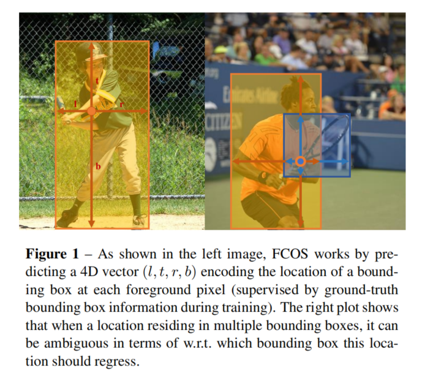
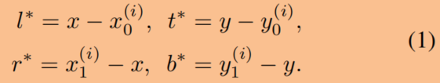
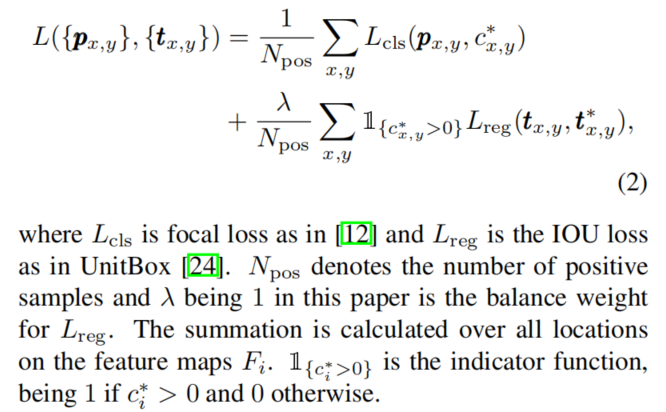
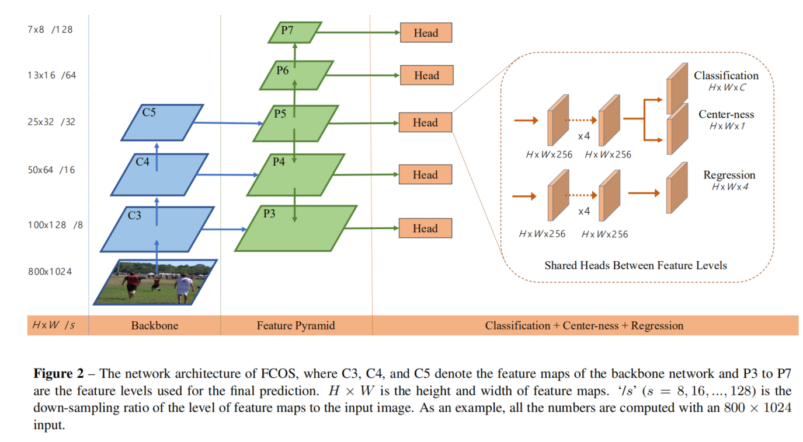
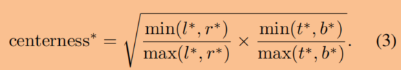
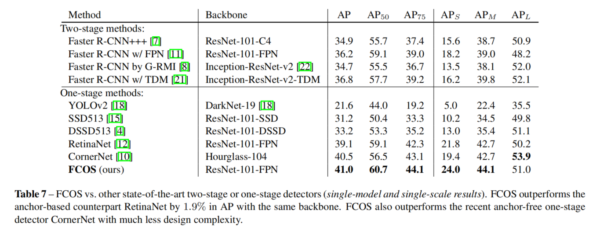

# FCOS: Fully Convolutional One-Stage Object Detection

**paper:**[FCOS](https://arxiv.org/abs/1904.01355)

## Abstract
We propose a fully convolutional one-stage object detector (FCOS) to solve object detection in a per-pixel prediction fashion, analogue to semantic segmentation. Almost all state-of-the-art object detectors such as RetinaNet, SSD, YOLOv3, and Faster R-CNN rely on pre-defined anchor boxes. In contrast, our proposed detector FCOS is anchor box free, as well as proposal free. By eliminating the predefined set of anchor boxes, FCOS completely avoids the complicated computation related to anchor boxes such as calculating overlapping during training. More importantly, we also avoid all hyper-parameters related to anchor boxes, which are often very sensitive to the final detection performance. With the only post-processing non-maximum suppression (NMS), FCOS with ResNeXt-64x4d-101 achieves 44.7% in AP with single-model and single-scale testing, surpassing previous one-stage detectors with the advantage of being much simpler. For the first time, we demonstrate a much simpler and flexible detection framework achieving improved detection accuracy. We hope that the proposed FCOS framework can serve as a simple and strong alternative for many other instance-level tasks. Code is available at:Code is available at: [this https URL](https://github.com/tianzhi0549/FCOS/)

## Contribution

**逐像素目标检测**

anchor free

本文提出的检测器直接将位置信息看做训练样本，而代替基于anchor的检测器中锚框。
ground truth ： Bi = （x0i, y0i, x1i, y1i, ci），分别表示边界框的左上角点和右下角点坐标和类别标签。
对于每一个位置（x，y）如果它落在任意一个ground truth边界框内，则将被看做是正样例，而且它的标签就是ground truth的标签Bi；否则，它就被划分为负样例，而且标签类别为c* = 0（背景类别）。除了类别信息外，还会有一个4维向量t* = (l*, t*, r*, b*)，分别表示中心坐标（x，y）距离边界框的四条边的距离,如上图一。所以，如果一个坐标（x，y）和边界框Bi相关联，则位置的训练回归目标满足的表达式如下：

值得注意的是，FCOS可以利用尽可能多的前景样本来训练回归量,因为只要位置点落在ground truth内则被认定为正样本。它不像基于anchor的那样需要IOU足够大时才被认定为正样例。

**网络输出：** 
对于coco数据集，预测80维的类别标签和4维的边界框坐标，如图2所示。

**Loss Function：**

**Inference:**
直接送入输入图像，得到预测得分Px,y和回归坐标值tx,y，根据预测的t值和对应的中心坐标利用公式1可以计算得到边界框。

### Multi-level Prediction with FPN for FCOS

- CNN中最后的特征图的大步长（例如，16×）可导致相对较低的最佳可能召回（BPR）。不过本文中基于FCN的FCOS也能得到很好的BPR。
- ground truth边界框的重叠会导致训练期间难以理解的模棱两可，即w.r.t. 在重叠边界框内部的一个点应该回归哪一个边界框？本文中实验表明使用多尺度进行预测可以很好的解决这种二义性。

构建好的特征金字塔中，在不同的特征层次上限制边界框回归的范围：首先计算所有特征层次上的每个点的回归目标t* ，然后如果max(l* , t* , r* ,b* )> m(i) 或者 max(l* , t* , r* ,b* ) < m(i-1)，那么它被看做为负样本，不需要回归任何一个边界框。这里m(i)是第i层特征图上需要回归的最大的距离，本文中m2、m3、m4、m5、m6、m7依次设置为0、64、128、256、512、∞。这样不同尺寸的对象被分配到不同的特征图层次上，而且边界框的重叠一般发生在不同大小的对象上，所以多层次预测就可以很好地改善这个问题。
最后，在不同的特征层次上共享头部。但是因为不同的特征图层次回归不同大小的范围，所以对于不同的特征级别使用相同的头是不合理的，因此我们就不使用exp(x)，代替使用exp(si x)，si是一个可训练的标量，在不同的特征层Pi上自适应调整exp函数，这样可以改进检测效果。

### Center-ness for FCOS

还存在另外一个问题，在远离对象中心的位置会有许多低质量的预测边界框，所以本文提出了一个高效的策略来抑制低质量的边界框而不需要其他的超参数。如图2中，在最后添加一个与分类分支平行的分支来预测“center-ness”（位置距离预测的对象的中心位置的距离）。对于一个位置给出回归量l* , t* , r* , b* ,定义如下公式：

结果在0-1之间，训练时使用二交叉熵损失并加到公式2中。当测试的时候最终的得分是预测的center-ness得分和分类得分的乘积，所以center-ness能够很好的降低远离对象中心的边界框的得分。

## Result

