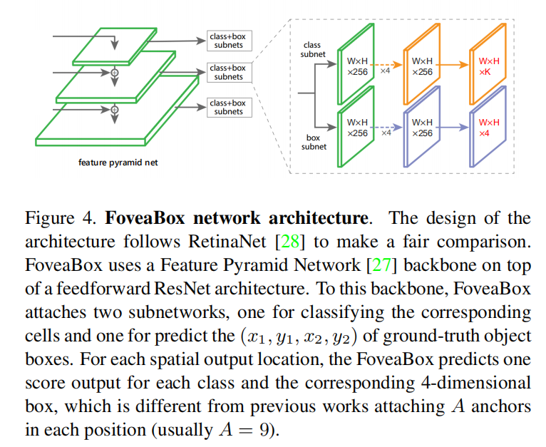
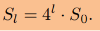
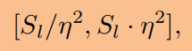
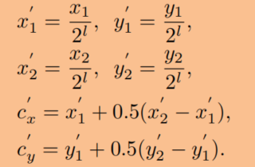
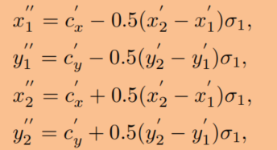
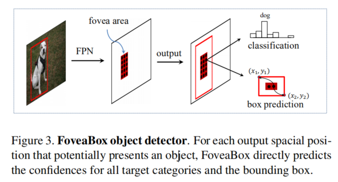
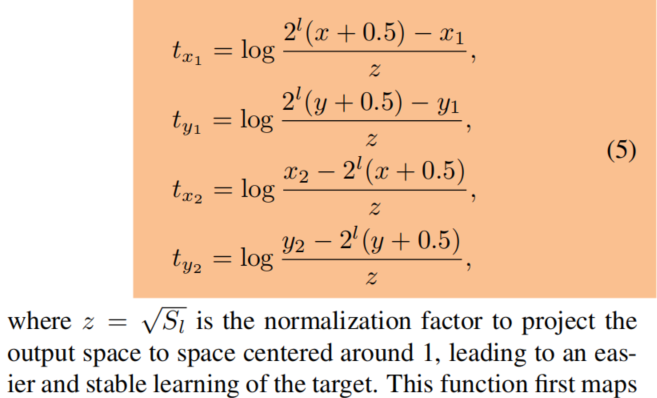
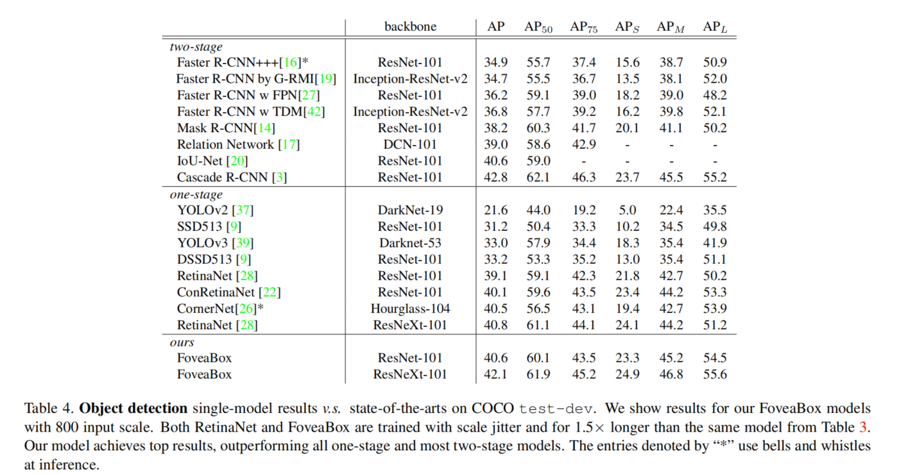

# FoveaBox: Beyond Anchor-based Object Detector
**paper:** [FoveaBox](https://arxiv.org/abs/1904.03797)

**笔记：** [note](http://192.168.73.132/www.sohu.com/a/310943843_500659)

## Abstract
We present FoveaBox, an accurate, flexible and completely anchor-free framework for object detection. While almost all state-of-the-art object detectors utilize the predefined anchors to enumerate possible locations, scales and aspect ratios for the search of the objects, their performance and generalization ability are also limited to the design of anchors. Instead, FoveaBox directly learns the object existing possibility and the bounding box coordinates without anchor reference. This is achieved by: (a) predicting category-sensitive semantic maps for the object existing possibility, and (b) producing category-agnostic bounding box for each position that potentially contains an object. The scales of target boxes are naturally associated with feature pyramid representations for each input image. Without bells and whistles, FoveaBox achieves state-of-the-art single model performance of 42.1 AP on the standard COCO detection benchmark. Specially for the objects with arbitrary aspect ratios, FoveaBox brings in significant improvement compared to the anchor-based detectors. More surprisingly, when it is challenged by the stretched testing images, FoveaBox shows great robustness and generalization ability to the changed distribution of bounding box shapes. The code will be made publicly available.

## Introduction

anchor-based方法的缺点：
- anchor box需要引入其他设计选择的额外超参数
- 针对一个特定数据集的anchor设计选择通常不适用于其他数据集上。（比如人脸检测anchor通常为正方形，而行人检测anchor通常为高的矩形）
- 因为在采样的图片中有很多的候选对象位置，因此密集对象检测器通常依赖高效的方法来解决前景、背景类别不平衡的问题

根据人类视觉系统中，在一个可视的场景中意识到一个对象而不需要枚举出所有的候选框。所以设计一个新的网络不依赖anchor的候选框。
FoveaBox，受人类视觉所启发，物体的中心具有最高的视敏度。FoveaBox仅仅预测可能存在物体中心区域的位置和每一个有效的位置的边界框。

## FoveaBox
骨干网络和两个子网络
骨干网络提取特征，第一个子网络对骨干网络的输出特征进行分类，第二个子网络对相应位置执行边界框预测

### FPN骨干网络
构建5层特征金字塔{Pl}，l=3,4,5,6,7，Pl的分辨率是输入图像的1/2^l，每层的特征通道数都是256

### 尺度分配
根据特征金字塔的层级，我们把对象的尺度大小划分到几个小区域内。从P3到P7层，每层有对应的基础的尺度大小32^2,64^2,...,512^2，对于第l层Pl，基础区域大小计算公式为：Sl = 4^l * S0.  其中S0设为16。

特征金字塔的每层对特定尺度的物体进行响应。第l层的响应范围是  η是控制每层的尺度范围的超参数。在训练时，尺度不在这个范围的目标对象将被忽略。

需要注意的是一个对象可能被网络的多层所检测到，这与之前的不同，之前的都是对象只能被特征金字塔的一层所检测。

### 正负样本选择
FoveaBox需要对特征图上每个点都预测一个分类结果以及并回归边框的偏移量，由于物体真实边框附近的点远离物体中心，或者与背景像素更为接近，如果将其作为正样本，对模型的训练造成困难。因此作者通过一个简单的变换，先通过groundtruh(x1，y1，x2，y2）边框得到物体中心在特征图中对应的位置，然后通过一个参数σ1调节物体高和宽，将用来训练的真实边框位置向物体中心收缩一点，收缩后的边框内部的点作为正样本，然后使用参数σ2再次调节边框高和宽，使其向外扩展一点，使用扩展边框外部的点作为负样本，这样将两个边框范围内的点忽略掉，增加正负样本之间的判别度。（实验中采用的是 σ1=0.3,σ2=0.4）。使用(x1,y1 ,x2,y2)表示物体边框的groundtruth，也就是物体左上和右下角位置，具体的转换公式如下所示：

   

### 边界框预测
本文目标:找到一种变换将feature maps的Fovea中(x,y)单元的网络位置输出（tx1，ty1，tx2，ty2）映射到ground truth box G（x1，y1，x2，y2）中：

上面函数首先将位置(x,y)映射至输入图片，然后计算映射后的坐标与G之间的偏差。最后通过Log-space进行处理

### Inference
首先经过 0.05 的置信度阈值过滤掉一部分置信度过低的预测框，在每层选出置信度排名前 1000 的矩形框，接下来用 0.5 的非极大值抑制单独对每个类别进行操作，最后选出图片中得分前 100 的矩形框。同时为了与基于锚点的目标检测方法进行对比，并没有在推理阶段采取软非极大值抑制和投票机制作为后处理的手段。

## Experiments

