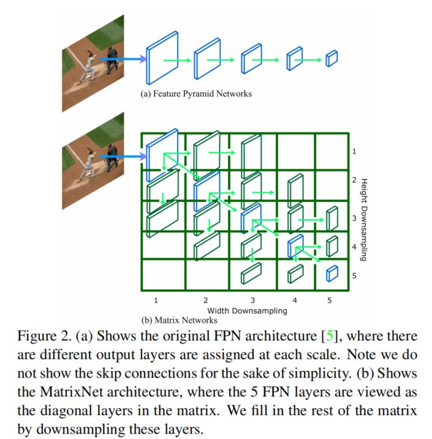
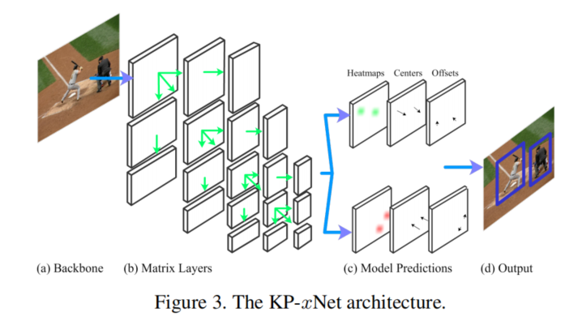
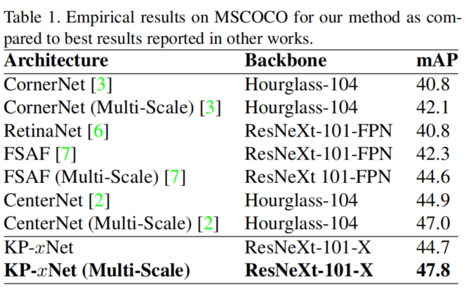

# Matrix Nets: A New Deep Architecture for Object Detection
**paper:** [Matrix Nets](https://arxiv.org/abs/1908.04646)

## Abstract

We present Matrix Nets (xNets), a new deep architecture for object detection. xNets map objects with different sizes and aspect ratios into layers where the sizes and the aspect ratios of the objects within their layers are nearly uniform. Hence, xNets provide a scale and aspect ratio aware architecture. We leverage xNets to enhance key-points based object detection. Our architecture achieves mAP of 47.8 on MS COCO, which is higher than any other single-shot detector while using half the number of parameters and training 3x faster than the next best architecture.

## Introduce

FPN仅仅提供了一种解决不同大小对象的方法，并没有给出针对不同长宽比对象的方法，比如高塔、长颈鹿等，长宽比较大时，如果将该对象分配到与长维度相关的层的话则会导致较小的一边的维度损失太多的信息。为了解决这个问题，提出了Matrix Nets，如上图所示。每个层处理特定大小和长宽比的对象。

在使用Matrix Nets进行基于关键点对象检测时，同样进行左上角点和右下角点的检测，不过没有使用corner pooling，而是使用了普通的卷积；在角点匹配时，没有使用CornerNet中的embedding，而是预测使用了中心位置。

## Matrix Nets
不同大小和长宽比的对象使用矩阵中不同的层，比如矩阵中区域（i，j）代表 li,j 层，对左上角的层 l1,1 进行宽度下采样2^(i-1)，高下采样2^(j-1)。矩阵的对角线上的层是FPN对用的层。 l1,1 是最大的层，每向右一步则宽度减小一半，每向下一步高度减小一半。矩阵中右上角和左下角的层模拟这长宽比很大或者很小的对象。

### Layer Generation
对角线上的层可以通过主干网络的不同阶段或者使用特征金字塔主干网络得到。上三角的层对对角巷上的层使用一系列共享的3×3卷积、1×2的步长得到。类似，左下角的层使用共享的3×3卷积、2×1的步长得到。

### Layer Ranges
每一层模拟着特定的大小和长宽比的对象，所以需要对每一层定义待分配对象的宽和高。因为每层的感受野向右逐渐2倍增大，向下也是逐渐2倍增大，所以我们定义宽和高也可以以2倍逐渐增大，即确定了左上角层的大小后，则所有的层的大小都会确定。
如果对象的大小正好在这个范围边界上，当对象大小稍微变化一点就会有很大变动，所以为了解决这个问题，将边界进行扩展实现小部分重叠，通过将范围的下限乘以小于1的数字，将上限乘以大于1的数字来实现的，在所有实验中，分别使用0.8和1.3。

## 基于关键点的对象检测
- CornerNet使用单层的输出层来处理不同大小和长宽比的对象
- 通过特征 embedding 匹配左上角点和右下角点
- CornerNet被迫使用Hourglass-104为主干网络才能实现最好的效果，不过参数多、模型大。。。

### 使用 Matrix Nets 基于关键点的对象检测

如上图所示，（a-b）是主干网络，（c）是共享的输出子网络，对于矩阵中的每一层预测对象在该层上的左上角点和右下角点的heatmap、角点偏移、中心预测值。（d）在同一层中使用中心预测值来匹配左上角点和右下角点。

#### Corner Heatmaps
使用xNets可确保某一层中对象所需的上下文受该层中单个特征图的感受野的限制。因此，不再需要corner pooling，传统的卷积层可以用来预测左上角点和右下角点的heatmap。

#### Corner Regression
由于图片下采样，所以微调角点来获得致密的边界框就很重要。当在一层中缩小尺度到x，y坐标角点时，我们也预测一个偏移量这样我们可以把角点按尺度放大到原图上而不损失精度。文中把偏移值限制在 -0.5 到 0.5 之间。使用L1损失优化参数。

#### Center Regression
因为角点匹配是在单独的矩阵的一层中执行的，所以得到的对象的宽和高是在固定范围内的。对象的中心可以被很容易回归因为中心的范围很小。而CornerNet则不行，中心的范围比较大，在单输出层回归中心很困难。而一旦中心获得到，通过在两个角点中比较回归的中心和实际的中心很容易将角点匹配到一起。

## Experiments

