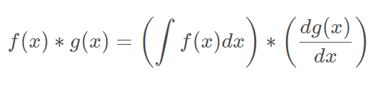
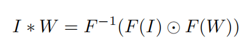
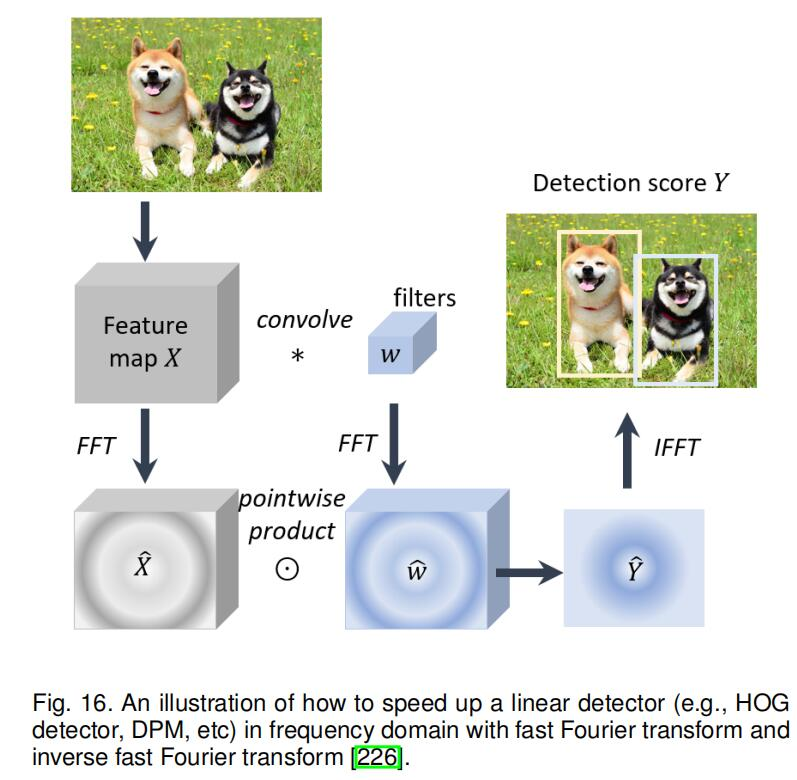
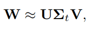
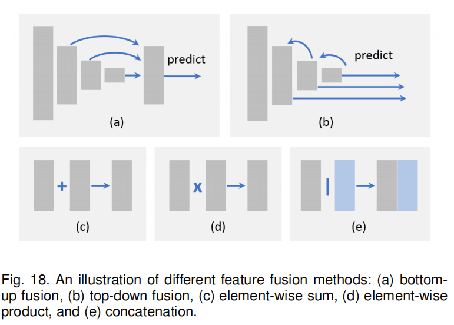
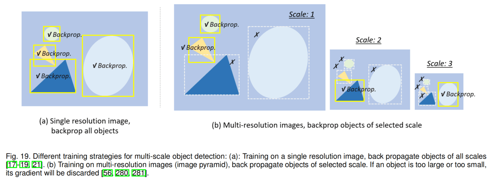

# Object Detection in 20 Years: A Survey
**paper：** [paper](https://arxiv.org/abs/1905.05055v2) `CVPR2019`

**论文笔记：**[url](https://blog.csdn.net/weixin_41665360/article/details/90445363#36_466)

## Contribution

Object detection, as of one the most fundamental and challenging problems in computer vision, has received great attention in recent years. Its development in the past two decades can be regarded as an epitome of computer vision history. If we think of today's object detection as a technical aesthetics under the power of deep learning, then turning back the clock 20 years we would witness the wisdom of cold weapon era. This paper extensively reviews 400+ papers of object detection in the light of its technical evolution, spanning over a quarter-century's time (from the 1990s to 2019). A number of topics have been covered in this paper, including the milestone detectors in history, detection datasets, metrics, fundamental building blocks of the detection system, speed up techniques, and the recent state of the art detection methods. This paper also reviews some important detection applications, such as pedestrian detection, face detection, text detection, etc, and makes an in-deep analysis of their challenges as well as technical improvements in recent years.

## 2 20年来的对象检测

## 2.1 对象检测的历程路
两个时期：传统的对象检测（2014之前），基于深度学习的对象检测（2014之后）

### 2.1.1 里程碑：传统的对象检测
- Viola Jones Detectors
- HOG Detector
- Deformable Part-based Model (DPM)

### 2.1.2 里程碑：基于CNN的两阶段检测器
- RCNN
- SPPNet
- Fast RCNN
- Faster RCNN
- Feature Pyramid Networks

### 2.1.3 里程碑：基于CNN的一阶段检测器
- You Only Look Once (YOLO)
- Single Shot MultiBox Detector (SSD)
- RetinaNet

## 2.2 对象检测数据集和度量指标
- Pascal VOC
- ILSVRC
- MS-COCO
- Open Images
- Datasets of Other Detection Tasks

### 2.2.1 度量指标
- Average Precision（AP）。AP is defined as the average detection precision under different recalls。
- mean AP(mAP)。
- Intersection over Union（IOU）。

mAP@[.5,.95]
mAP@.5

## 2.3 对象检测中的技术改进

### 2.3.1 早期的黑暗时期
- Components, shapes and edges
- Early time’s CNN for object detection

### 2.3.2 多尺度检测的技术进化
- Feature pyramids + sliding windows (before 2014)
- Detection with object proposals (2010-2015)
- Deep regression (2013-2016)
- Multi-reference/-resolution detection (after 2015)

### 2.3.3 边界框回归的技术进化
- Without BB regression (before 2008)
- From BB to BB (2008-2013)
- From features to BB (after 2013)

### 2.3.4 Context Priming的技术进化
- Detection with local context
- Detection with global context
- Context interactive

### 2.3.5 非极大抑制（Non-Maximum Suppression）的技术进化
- Greedy selection（贪心选择），常用
- BB aggregation
- Learning to NMS

### 2.3.6 难例挖掘（Hard Negative Mining）的技术进化
- Bootstrap
- HNM in deep learning based detector

## 3 检测加速
检测管道加速、检测引擎加速、数字计算加速

## 3.1 特征图共享计算
### 3.1.1 空间计算冗余与加速
### 3.1.2 尺度计算冗余与加速

## 3.2 分类器加速

## 3.3 级联检测

## 3.4 网络剪枝与量化
### 3.4.1 网络剪枝
### 3.4.2 网络量化
### 3.4.3 网络蒸馏

## 3.5 轻量级网络设计
### 3.5.1 分解卷积（Factorizing Convolutions）
### 3.5.2 群卷积（Group Convolution）
### 3.5.3 深度可分卷积（Depth-wise Separable Convolution）
### 3.5.4 瓶颈结构（Bottle-neck Design）
### 3.5.5 神经网络搜索（Neural Architecture Search）

## 3.6 数值加速
- 积分图加速
- 频域加速
- 矢量量化
- 降秩逼近

### 3.6.1 积分图加速

积分图能够帮助快速计算图像子区域的和。其本质是信号处理中，卷积的积分—微分可分性。

其中，dg(x)/dx d g(x) / d xdg(x)/dx 是一个稀疏信号，卷积可以通过等式的右边进行加速。

### 3.6.2 频域加速

由于线性检测器的检测可以被看做是特征图和检测权值的窗口内积，这一过程可以用卷积来实现
卷积可以以多种方式加速，傅里叶变换是非常实用的的选择，特别是加速大卷积核。频域加速卷积的理论基础是信号处理中的卷积定理，即，在适当的条件下，两个信号卷积的傅里叶变换是其傅里叶空间中的逐点乘积。

其中 F 为傅里叶变换，F−1为傅里叶反变换，I 和 W 是输入图像和卷积核， * 是卷积运算，⊙ 是逐点乘积

### 3.6.3 矢量量化
VQ（Vector Quantization） 是信号处理中一种经典量化方法，目的是通过一小组原型向量来近似一大组数据分布。可用于目标检测中的数据压缩和加速内积操作。检测阶段特征向量和检测权重之间的内积可以通过查表来实现，没有浮点数的乘法和除法，可以加速很大。

### 3.6.4 降秩逼近

深度网络中，全连接层的计算实际上是两个矩阵的乘法。当参数矩阵 W∈R^(u×v) 很大时，检测器的计算负担很重。降秩近似是加速矩阵乘法的一种方法。目的是对矩阵 W 进行低阶分解：

其中，U 是由 W 的前 t 个左奇异向量组成的 u×t 矩阵；Σt 是包含 W 最上面 t 个奇异值的 t×t 对角矩阵；V 是由 W 的前 t 个右奇异向量组成的 v×t 矩阵。以上过程也称为截断 SVD。将参数数量从 uv 减到 t(u+v)。如果 t 比 min(u,v)小得多，效果很显著。截断 SVD 为 Fast RCNN 实现了2倍加速。

## 4 对象检测最近的进展
## 4.1 用最好的主干网络来检测
检测的精度依靠着网络的特征提取能力，所以主干网络很重要。
- AlexNet ：8层的深度网络，是第一个CNN模型，开启了计算机视觉中深度学习的发展。

- VGG ：将模型的深度增加到了16-19层，代替AlexNet中5×5和7×7的卷积，使用很小的3×3的卷积过滤器。

- GoogLeNet ：Inception网络家族，增加卷积神经网络深到（22层）和宽度。Inception网络家族最大的贡献在于分解卷积（factorizing convolution）和批量归一化（batch normalization）。

- ResNet ：  一个新的卷积网络结构，实际上比之前所有的网络都深（可达152层）

- DenseNet ：受 short cut 连接的影响，作者将每一层以前馈的方式和其他所有层相连。

- SENet ：主要贡献是将全局池化与 shuffling 结合，学习特征图通道（channel-wist）的重要性。

## 4.2 用更好的特征来检测
努力提高图像特征质量，最重要的两组方法是：
- 特征融合
- 学习具有大感受野的高分辨率特征

### 4.2.1 特征融合的重要性
不变性和等变是图像特征表示中的两个重要性质。分类要求特征具有不变性；目标定位需要等变表示，因为它旨在区分位置和尺度变化。由于目标检测包含这两个子任务，所以需要同时学习不变性和等变性。
由于 CNN 的深层具有更好的不变性，更差的等变性，这对分类任务有益，但是不利于精确目标定位。相反，浅层具有更好的等变性，但是不变性较差。 因此，深层和浅层特征融合有助于提高不变性和等变性。

### 4.2.2 特征融合的不同方法

- 处理流（Processing flow）
- 逐元素操作（Element-wise operation）

**处理流：**
- 自底向上融合 ：通过跳跃连接将浅层特征传递到深层
- 自上而下融合 ：将深层特征反馈给浅层
- 还有一些更复杂的方法，跨不同层编织特征

由于不同层特征在空间和通道维度上可能不同，可能需要调整特征图通道数，上采样低分辨率特征图，降采样高分辨率特征图。最简单的方法是最邻近或者双线性插值。此外，分数步长卷积（转置卷积 fractional strided convolution）是最近另一种流行的调整特征图大小和通道数的方法。这种方法的优点是可以自动学习上采样。

**逐元素操作：**
特征融合可以被看做是不同特征图间的元素运算。主要有几组方法：
- 元素求和
- 元素乘积
- 串联

元素求和是最简单的特征融合方法。元素乘积和元素求和非常相似，唯一不同是使用乘法而不是加法。元素乘积的优点是可以抑制或者强调某一区域内特征，可能有利于小目标检测。特征串联的优点是可以整合不同区域的上下文特征，缺点是增加内存消耗。

### 4.2.3 学习具有大感受野的高分辨率特征

大感受野能够捕获大尺度上下文信息，小感受野更关注局部细节。特征图分辨率越小，越难检测小目标。增加特征分辨率最直接的方法是去除池化层，或者减小卷积下采样率。但是这样同时会减小感受野。
同时增加感受野和分辨率的方法是引入空洞卷积。空洞卷积最初用于语义分割。主要思想是使用稀疏参数扩大卷积核。2空洞印子的3×3卷积核的感受野与5×5的感受野一样。

## 4.3 越过滑动窗口

尽管 CNN 在目标检测领域已经得到广泛应用，但是它仍然遵循 “在特征图上滑动窗口” 的检测范式。仍有一些检测器超越滑动窗口限制。
- 子区域搜索检测 ：将检测看作路径规划过程，从初始网格开始，最终收敛到 GT 框。另一种方法将检测看作迭代更新过程来细化指定边界框角点。

- 关键点定位检测 ：由于目标位置可以由左上角和右下角确定，因此检测任务可以等价为一对关键点定位问题（例如[CornerNet](https://github.com/hbkooo/PaperTest/tree/master/HBK/cornerNet)）。该方法的优点是可以在语义分割框架下实现，不需要设计多尺度锚。

## 4.4 改进定位
提高定位精度有两种方法：
- 回归边界框
- 为精确的定位设计新的损失函数
 ### 4.4.1 边界框回归
 它可以看作是检测结果的后处理。一些非常规尺度的目标难以被预定义的锚（anchor）捕获，不可避免地导致不精确的位置预测。因此引入迭代边界框精炼，将检测结果迭代地输入到 BB BBBB 回归器，直到预测收敛到正确位置和大小。然而，也有研究者认为，这种方法难以保证定位精度的单调性，也就是说，BB BBBB 回归多次应用会使定位退化。
 
 ### 4.4.2 改进精确定位的损失函数
 
 检测器大多将目标定位看作坐标回归问题。然而这种范式有两个缺陷：
 - 回归损失函数和最终定位评估不对应
 - 传统边界框回归不包含定位置信度，当多个 BB BBBB 重叠导致非最大抑制失效
 通过设计新的损失函数可以解决这些问题。最直接的思路是直接使用 IoU 作为定位损失函数。其他一些研究者提出使用 IoU 引导的 NMS 来改进训练和检测阶段的定位。还有研究者尝试在概率推理框架下改进定位精度，与以往直接预测边界框坐标的方法不同，这种方法可以预测边界框位置的概率分布。
 
 ## 4.5 用分割学习
 最近的研究表明，学习语义分割可以提升目标检测性能。
 
 ### 4.5.1 语义分割可以改进检测的原因
 - 分割有助于类别的识别
 - 分割有助于精确定位
 - 分割可以作为上下文嵌入
### 4.5.2 分割是怎么改进检测的
有两种方法可以通过分割来改进对象检测：
- 学习丰富的特征 ： 将分割网络看作固定特征提取器，集成到检测框架中作为额外的特征。优点是易实现，缺点是带来附加计算。

- 学习多任务损失函数 ： 在原始检测网络的顶部引入分割分支，使用多任务损失训练（分割损失+检测损失），推理阶段去除分割分支。优点是检测速度不受影响，缺点是训练需要像素级图像标注。因此，一些研究者遵循弱监督学习思想，不是基于像素级注释掩码，而是边界框注释来训练分割分支。

## 4.6 对旋转和尺度变化鲁棒的检测

### 4.6.1 旋转鲁棒性检测
传统的方法主要有两类：
- 数据增强
- 为不同方位对象训练独立检测器

新的方法：
- 旋转不变性损失函数 ：在原始的对象检测的损失函数中新增约束，从而使旋转目标的特征不发生改变
- 旋转校准 ：对候选目标做几何变换，增加旋转不变性。代表是空间变换网络（STN）
- 旋转ROI池化 ：取代笛卡尔坐标，在极坐标中划分网格增加旋转不变性。

### 4.6.2 尺度鲁棒性

- 尺度自适应训练 ：大部分检测器将输入图像re-scale到固定大小，然后将所有尺度的对象的损失都反向传递，如图19(a)。图像金字塔尺度归一化（SNIP），在训练和测试阶段建立图像金字塔并只反向传播某些特定尺度，如图19(b)。SNIPER 高效重采样 SNIP ，将图像裁剪、缩放到一组子区域，从大规模训练中受益。
- 尺度自适应检测 ：预定义 anchor 不能自适应检测非常规尺度目标，为提升小目标检测，采取自适应放大技术将小目标放大。另一种思路是学习图像中目标的尺度分布，根据目标尺度分布自适应缩放图像。

## 4.7 从头开始训练（Training from Scratch）
大部分深度学习检测器都是在大规模数据集上预训练，然后在确定的检测任务中微调。通常认为预训练可以提高模型泛化能力，并且加快训练速度。事实上采用预训练网络有一些局限性：
- 第一个限制是，分类和目标检测之间的差异，包括损失函数以及尺度/类别分布的差异。
- 第二个是域不匹配。ImageNet 是 RGB 图像，检测任务有时需要使用深度图像。
现在有人开始从头训练，为了加速训练以及从头训练的稳定性，一些研究人员引入了密集连接和 BN 以加速浅层的反向传播。研究人员发现，ImageNet ImageNetImageNet 预训练可以加快收敛速度，但是不一定有正则化或者提高最终精度的作用

## 4.8 对抗训练（Adversarial Training）

典型的GAN（Generative Adversarial Networks生成对抗网络）由生成器和判别器组成，在极大极小优化框架内竞争。典型地，生成器学习从潜在空间映射到感兴趣的特定数据分布，而鉴别器旨在区分真实数据分布的实例和由生成器生成的实例。GAN 近年来主要用于遮挡和小目标检测。
GAN 通过缩小小目标和大目标之间的表示差异，来提升对小目标的检测。为提升对遮挡目标的检测，一个思路是利用对抗性训练来产生遮挡掩码，取代在像素空间生成样本，对抗网络直接修改特征以模拟遮挡。
除了这些研究之外，旨在研究如何用对抗样本攻击检测器的“对抗攻击”最近引起了越来越多的关注。关于这一主题的研究对于自主驾驶尤其重要，因为在保证对抗攻击的鲁棒性之前，不能完全信任它。

## 4.9 弱监督对象检测
弱监督目标检测器（Weakly Supervised Object Detection WSOD）旨在通过图像级标注而不是边界框标注来训练检测器，从而减少对标注数据集的依赖。
近来，多实例学习已经用于 WSOD。多实例学习是一组监督学习方法。多实例学习模型接收一组标记的包，每个包包含许多实例，而不是使用一组单独标记的实例进行学习。如果将一幅图像中的候选目标视为一个包，将图像级注释视为标签，那么 WSOD 可以被表示为一个多实例学习过程。
类激活映射是另一组用于 WSOD 的方法。对 CNN 可视化的研究表明，尽管没有对目标的位置进行监督， CNN 的卷积层仍然充当目标检测器。类别激活映射揭示了如何使 CNN 在接受图像级标签训练后仍具有定位能力。
除了上述方法之外，一些其他研究人员通过选择信息量最大的区域，然后用图像级注释来训练这些区域，从而将 WSOD 视为提议排序过程。WSOD 的另一个简单方法是掩盖图像的不同部分，如果检测分数急剧下降，那么目标很可能被覆盖。此外，交互式注释在训练中考虑了人的反馈，以便改善 WSOD。最近，生成对抗训练被用于 WSOD。

## 5 应用
## 5.1 行人检测
早期的方法：HOG检测器、ICF检测器，为目标检测奠定了基础，近年来，一些检测方法，比如Faster R-CNN，取得了进步。

### 5.1.1 困难和挑战
- 小行人目标。行人像素太小
- 难分负样本（Hard negatives）。比如街道上的一些背景可能与行人很相似。
- 密集和遮挡的行人目标。
- 实时检测。

### 5.1.2 文献综述（Literature Review）
**传统行人检测方法**
基于 Haar 小波特征；部件检测（检测头、腿、胳膊等）；DPM 检测器；利用积分图像处理技术，提出了一种有效的，轻量级特征表示：积分通道特征（ICF）。

**基于深度学习的行人检测方法**
- 改进小行人检测 ：特征融合；引入高分辨率手工特征，集成多分辨率检测结果
- 改进难分负样本检测 ：包含增强决策树的集成和语义分割。此外，跨模式学习也被用来丰富难分负样本特征。
- 改进密集和遮挡行人检测 ：设计新的损失函数，考虑目标的吸引以及和周围其他目标的排斥。部位检测器和注意力机制是改善遮挡行人检测的最常用方法。

## 5.2 人脸检测
早期方法：VJ检测器。对现在的对象检测仍有很重要的作用

### 5.2.1 困难和挑战
- 类内变化 ：人脸变化可能会很大，比如表情、肤色、姿势等。
- 遮挡 ：人脸可能被其他对象所遮挡。
- 多尺度检测 ：检测人脸可能在大规模中，尤其是小人脸。
- 实时检测。

### 5.2.2 文献综述
**早期人脸检测（2001之前）**
- 基于规则的方法 ：典型人脸的构成和获取面部元素之间的关系
- 基于子空间分析的方法 ：在线性空间下分析人脸属性
- 基于学习的方法 ：人脸识别看做为滑动窗口+二分类的过程。包括神经网络和支持向量机SVM。

**传统人脸检测（2000-2015）**
- 基于增强决策树 ：易计算，但是复杂条件下精度低
- 基于早期卷积神经网络 ：共享计算以加快检测速度

**基于深度学习的人脸检测（2015之后）**
跟随与对象检测算法的思想。
- 加速人脸检测 ：cascade 检测；预测图片中人脸尺度分布，在选择的尺度上进行检测。
- 改进多姿态和遮挡人脸检测 ：face calibration用来改进多姿态。改进遮挡：整合注意力机制，突出潜在人脸目标特征；基于部位的检测。
- 改进多尺度人脸检测 ：与对象检测类似：多尺度的特征融合，多分辨率检测。

## 5.3 文本检测
### 5.3.1 困难和挑战
- 不同字体和语言
- 文本旋转与透视失真
- 文本密集
- 破碎模糊的字符

### 5.3.2 文献综述
主要分成两个独立但相关的任务：文本定位；文本识别。
方法：逐步检测；结合检测

**逐步检测 VS 结合检测**
- 逐步检测包含过程步骤：字符分割；候选区域验证；字符分组；字识别；优点是粗分割步骤中对背景进行滤波，降低后续计算量；缺点是需要仔细设置所有步骤中参数，误差会在每一步中积累。
- 结合检测，将字符定位、分组、识别在同一个结构下处理。优点：避免了累积的错误，容易结合语言模型。缺点：考虑到大量的字符类别和候选窗口时推理的计算消耗很大。

**传统方法 VS 深度学习方法**
方法：是一般目标检测的特例；将文本检测看作图像分割问题。

- 文本旋转和视角改变 ：在anchor和ROI池化时新增参数来表示旋转的改变。
- 改进密集分布的文本检测 ：基于分割的方法对检测密集分布的文本更有益处。但是需要检测文本线：①分割和连接（segment and linking）segment代表字符heatmap，linking代表邻近的segment说明它们属于一个单词；②新增一个额外的角或边界检测任务。
- 改进破碎模糊文本检测 ：使用单词水平的识别和句子水平的识别。

## 5.4 交通信号和交通灯检测
### 5.4.1 困难和挑战
- 光照变化
- 运动模糊
- 坏天气
- 实时检测

### 5.4.2 文献综述

**传统检测方法**
颜色阈值、视觉显著性检测、形态学过滤、边缘或轮廓分析。
其他方法：结合GPS和数字地图；

**基于深度学习的检测方法**
注意力机制、对抗训练等。

## 5.5 遥感目标检测
### 5.5.1 困难和挑战
- 大量数据中的检测
- 遮挡目标
- 域自适应

### 5.5.2 文献综述

**传统的检测方法**
一般包含两步：候选提取、目标验证。

**基于深度学习的检测方法**
改进ROI池化适应角度，采用注意力机制，特征融合，

## 6 总结与展望
未来的研究可能集中在几个方面：
- 轻量级目标检测
- 检测与 AutoML  （自动）
- 检测与域自适应
- 弱监督检测 ： 依靠图像级的标注，不使用边界框级别的标注，来降低消耗的代价。
- 小目标检测
- 视频中的检测（实时）
- 信息融合检测

