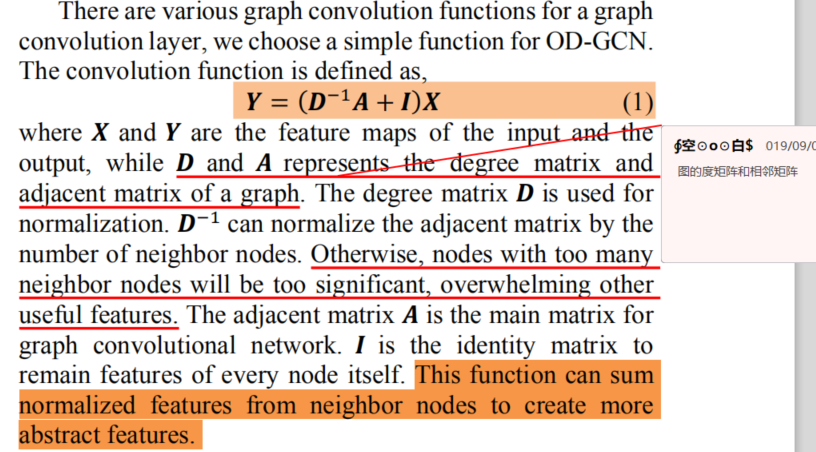

# OD-GCN: OBJECT DETECTION BY KNOWLEDGE GRAPH WITH GCN

**paper:** [OD_GCN](https://arxiv.org/abs/1908.04385)

## Abstract
Classical object detection frameworks lack of utilizing objects' surrounding information. In this article, we introduce the graph convolutional networks (GCN) into the object detection, and propose a new framework called OD-GCN (object detection with graph convolutional network). It utilizes the category relationship to improve the detection precision. We set up a knowledge graph to reflect the co-exist relationships among objects. GCN plays the role of post-processing to adjust the output of base object detection models. It is a flexible framework that any pre-trained object detection models can be used as the base model. In the experiments, we try several popular base detection models, OD-GCN always improve mAP by 1-5 pp in COCO dataset. In addition, visualized analysis reveals the benchmark improvement is quite logical in human's opinion.

## Approach

### Graph Convolutional Network(GCN)

图卷机网络是为了图(Graph)结构而设计的一种深度可训练网络。在图(Graph)上进行图卷积操作和在图像(image)上进行的传统卷积类似。可以通过一个图(Graph)卷积操作来改变图(Graph)特征图的通道数，在一个节点上的新的特征图和它邻近的节点的上一个特征图相关。

对coco数据集构建知识图谱，例如图谱中从类别A到类别B的边通过P(B|A)计算。比如coco数据集中猫狗一块出现4次，而猫一共出现8次，则从猫到狗的边定义为P(dog|cat)=4/8=0.5。而且，通过类别相关矩阵构建的其他类别知识图谱也可以适合于OD-GCN框架。
通过构建的知识图谱，就可以得到相邻矩阵A和度矩阵D，用来执行图卷积网络。

### 使用GCN进行对象检测（OD-GCN）

使用SSD或者Faster R-CNN来作为基础的检测框架，后续用知识图谱进行后处理。

#### 传统的对象检测阶段

在这阶段，使用传统的对象检测框架SSD或者Yolo或者Faster R-CNN来检测，输入原始图像，得到B×C的特征图，B是所有检测框的个数，C是类别数。B×C是所有边界框原始的得分，为了优化，可以使用Softmax层将得分裁剪到0-1之间。特别的，当原始得分包含正数和负数时，很难通过我们设计的框架中的点乘操作来调整最后的结果。

#### GCN 后处理阶段
通过上面得到的知识图谱，我们可以得到 C×C 的邻近矩阵A和 C×C 的度矩阵D。除此之外，保留 B×C 原始得分数据中边界框维度的最大值，得到 1×C 的向量是GCN后处理框架的输入特征。
上面取边界框维度的最大值是有原因的，其实还可以取求和、平均值，但是求和值很容易被周围对象的数目所影响，例如如果有很多A类别的对象，关于A类别的其他得分将会被调整到很高的水平；同样平均值的噪声比最大值噪声也更大。最后实验得出取最大值是最好的效果。

GCN的输入时图谱和输入特征，最后得到 1×C 的特征来对预测结果进行调整。B×C 的原始得分矩阵按行和 1×C 的调整特征做点乘得到调整后的得分矩阵。

GCN容易过拟合，一般不会超过6层，本文中使用2层，一层图卷积层的操作定义如下：

Hl : C×C1， Hl+1 : C×C2  ， C1、C2分别是输入和输出通道数目； 可训练权重矩阵 W ：C1×C2 （W的初始化为1）

### Implementation details
GCN由两个图卷积层组成，通道数变化为：1 -> 4 -> 1 ，激活函数ReLU；GCN的最后一层添加了额外的可训练变量b，定义如下： 

所有的损失函数定义如下：

## Experiment

mAP @ k是具有IoU限制的所有类别中的平均AP。 限制是预测和标签的交叉联合（IoU）需要大于k，否则预测被认为是错误的.
mAP@0.5:0.95 是具有不同IOU阈值的平均mAP（mAp@0.5，mAP@0.55，mAP@0.6，...，mAP@0.90，mAP@0.95）

实验结果如下图所示，

