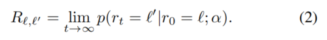

# Object Detection Meets Knowledge Graphs

## Abstract

Object detection in images is a crucial task in computer vision, with important applications ranging from security surveillance to autonomous vehicles. Existing state-of-the-art algorithms, including deep neural networks, only focus on utilizing features within an image itself, largely neglecting the vast amount of background knowledge about the real world. In this paper, we propose a novel framework of knowledge-aware object detection, which enables the integration of external knowledge such as knowledge graphs into any object detection algorithm. The framework employs the notion of semantic consistency to quantify and generalize knowledge, which improves object detection through a re-optimization process to achieve better consistency with background knowledge. Finally, empirical evaluation on two benchmark datasets show that our approach can significantly increase recall by up to 6.3 points without compromising mean average precision, when compared to the state-of-the-art baseline.

## Introduction

根据人类已知的背景知识，我们可以很好地对对象作出推断。但是这个背景知识出现随机而且很难来组织，有一些研究和工作来将这些信息编码成机器可读的形式，成为知识图谱。一个知识图谱用来模拟语义知识的图，图的每个节点表示一个现实世界中的概念（concept），每一条边表示两个概念之间的关系。

**挑战和方法：**
尽管已经有了知识图谱，但是在对象检测中有效利用知识也有很大的挑战：
- 我们如何量化和生成知识图谱。   ==》  在我们的方法中，对于知识图中的每对概念，我们计算它们的语义一致性的数值程度
- 我们如何结合语义一致性来实现知识感知对象检测。   ==》  我们依赖于关键约束，在具有可比概率的图像中，更可能出现那些更具语义一致性的概念（concept）

**Contribution：**
- 我们主张将知识融入到对象检测中，这是一种在视觉任务中仍然有限的新兴范例
- 我们制定了一个知识感知框架，该框架以可推广的方式基于知识图来量化语义一致性，并进一步重新优化对象检测以实现更好的一致性。
- 在两个基准数据集中，提高召回率达到6.3个百分点，同时保持相同的精度水平。

## Proposed Approach

### Notations and Problem

目标是基于原始的得分矩阵P和已有的知识概念之间的语义一致性来得到新的矩阵P^。即P^是P在知识感知中的增强。
新的矩阵 P^ 可以改进检测效果，边界框 b 被分配一个新的标签 l^ = argmaxl(P^bl)。框架如图所示。

### Semantic Consistency 语义一致性
为了构建知识感知框架，首先要量化知识，特别是以可以概括为具有未观察到的上下文的图像的方式。最后，对于每对概念，计算它们的语义一致性的数值程度。数值程度越高，说明这两个概念在同一张图片中出现的概率越大。

定义 S 为 L×L 的矩阵， Sl,l' 是概念 l 和 l' 之间的语义一致的数值。 通常情况下， S 应该是对称的， 例如 Sl,l' = Sl',l。 当 l = l' 时，Sl,l' 表示自身一致性，这是有意义的，因为相同概念的多个实例可以出现在同一图像中。
换句话说，用矩阵S可以量化和模拟不同概念之间额外的背景知识。还有两种方法来构建 S : 
- 使用简单的频率
- 基于知识图谱

#### Frequency-based knowledge

n(l,l') 定义为概念 l 和 l' 同现的次数， n(l) 表示 l 出现的次数， N 是在所有的背景数据中实例的所有数目。
当 l 和 l' 独立，或者他们同现的频率比独立发生的频率低，那么值将为0；否则值为正。

上面的计算方法存在两个缺点：
- 收集足够的高质量标注的背景数据是很困难并且代价昂贵的，特别是当给出的检测模型是以黑盒子的方式给出并且没有伴随的训练数据。
- 结果矩阵 S 仅仅在已知的背景数据中的同现概念起作用，但是并不会生成新图像中未见的同现对象。换句话说，如果两个概念在背景数据中从来没有同现，那么他们的语义一致性将会为0，这对那些包含这两个概念的新图片是没有帮助的

#### Graph-based knowledge

一个知识图谱可以捕获上百万个概念和他们之间复杂的关系。
使用大型的知识图谱有很大的优点：它可以很好地生成一对概念之间的联系，即使他们之间并没有用任意一条边连接。即，当两个概念之间没有直接的关系时，潜在的我们也可以为他们建立联系。比如图二中，人和盘子之间没直接联系，但是“人养猫为宠物”，“猫添盘子”，因此我们也可以为人和盘子建立一条链。
两种概念之间的不同路径相互补充，以增强鲁棒性。

为了量化知识图谱，我们使用以下方法：从图中的一个顶点 V0 开始出发，随机移动到 V0 的相邻节点，记录为 V1，到达 V1 后我们可以重复同样的步骤。另外，为了避免被困在较小的位置，每次移动时，α都有可能通过“传送”到起始节点v0而不是移动到相邻节点之一来重新开始随机游走。
随机走的节点为（V0,V1,...,Vt）， P(Vt=l' | v0=l;α) 代表我们从 l 开始，走 t 步到达 l' 的可能性。
上面这个可能性可以用来计算语义一致性，当从 l 到 l' 的可能性越大表明他们越语义相关。

上面的公式（2）中 Rl,l' 不是对称的，所以使用下面的公式（3）得到对称矩阵 S。

### Knowledge-Aware Re-optimization

#### Cost function
最关键的直觉是语义一致性数值越高的两个概念越可能在同一张图片中出现。也就是，对于一张图片中的两个边界框 b 和 b' ，当 Sl,l' 很大时， Pb,l 和 Pb',l' 不应该有很大的不同。所以，定义的损失函数如下：

式中 Pb,l 和 P^b,l 分别表示已经有的检测模型的结果和本文基于知识图谱的检测结果。
式中的第一项约束了语义一致性，对于两个边界框 b 和 b',如果 Sl,l' 很大，最小化代价函数则会使 P^b,l , P^b',l'相近；如果 Sl,l' 很小， P^b,l 和 P^b',l'将不被约束，差异会很大。
第二项要求知识检测不能与现有算法的检测相差太大。请注意，平方误差的系数为B| Sl,* |1，以便平衡不同的概念。 如果没有该系数，则当 | Sl,∗ | 较大时，在涉及 Pb,l ，∀b∈B的总和上，成本函数将更重视第一项。

#### Optimization

## Conclusion

首先生成背景数据的知识图谱，获取语义一致性信息。然后把这些知识用到已有的对象检测算法中，通过再次优化检测结果得到更好的语义一致性。

