# CornerNet: Detecting Objects as Paired Keypoints

**paper:** [CornetNet](https://arxiv.org/abs/1808.01244) `CVPR2018`

**github:** [cornerNet_github](https://github.com/princeton-vl/CornerNet)

## Abstract
We propose CornerNet, a new approach to object detection where we detect an object bounding box as a pair of keypoints, the top-left corner and the bottom-right corner, using a single convolution neural network. By detecting objects as paired keypoints, we eliminate the need for designing a set of anchor boxes commonly used in prior single-stage detectors. In addition to our novel formulation, we introduce corner pooling, a new type of pooling layer that helps the network better localize corners. Experiments show that CornerNet achieves a 42.2% AP on MS COCO, outperforming all existing one-stage detectors.

## Contributions

这篇论文提出了一个新的网络CornerNet，是一个不使用anchor的一阶段检测器。用一对关键点来检测对象：边界框的左上角点和右下角点。我们使用一个单独的卷积网络预测：一张相同对象类别的所有实例的左上角的heatmap，预测一张相同对象类别的所有实例的右下角的heatmap，和对于每一个检测角的嵌入向量（embedding vector）。这个嵌入向量用来把属于相同对象的角划分为一组。我们的方法极大地简化了网络的输出并且消除了设计anchor边界框的需求。示意图如图1所示。

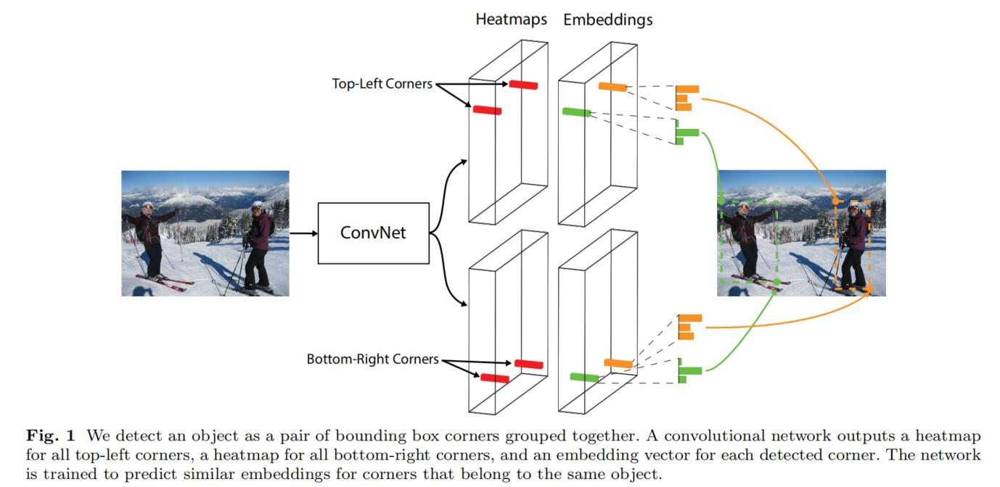

还提出了另一个新奇的部分：corner pooling，一个新类型的池化层来帮助卷积网络更好地定位边界框的角。边界框的角通常都在对象的外面，例如一个圆形的对象，这种情况下为了定位左上角的像素位置，我们需要在水平方向上看左上角点的右边是对象边界框的最顶部位置，垂直方向看左上角点的下边是对象边界框的最左边位置。这就激励了我们的corner pooling：使用两张特征图；对于每一个像素位置，从第一张图征途上最大池化右侧所有的特征向量，从第二章特征图上最大池化下边所有的特征向量，然后将两个池化的结果相加。示意图如3所示。

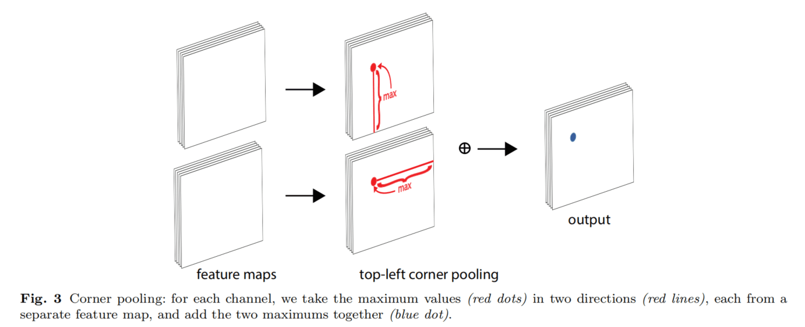

检测角点要比检测边界框的中心或者proposal要好的原因有两个：①边界框的中心很难定位因为需要依赖对象的4条边，而定位边角只需要依赖2条边，同时引入了coner pool的先验，因此，定位更加简单。②角点高效的离散了框的解空间，只需要O(wh)的角点可以表示O(w^2h^2)的anchor box的数量。

## CornerNet Overview

图4是CornerNet的综述：使用hourglass（沙漏）网络作为主干网络，沙漏网络后跟着两个预测模块：一个模块预测左上角点，另一个模块预测右下角点。在预测heatmaps、embeddings和offsets之前，每个模块都有自己的corner pooling module来池化从沙漏网络中得到的特征图。不像其他的对象检测器，我们不使用不同尺度的特征图来检测不同大小的对象。我们只将两个模块应用于沙漏网络的输出。

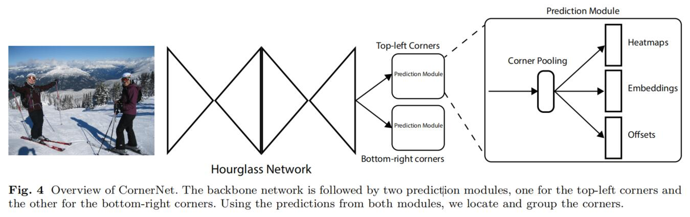

### Detecting Corners

我们预测两组heatmaps，一组是左上角点另一组是右下角点。每组heatmaps有C个通道，C是类别的数目，大小是 H × W。这里没有背景的通道。每个通道是一个二进制的掩码用于指示该角点位置是否为该类别。

对于每一个角点，有一个ground truth作为正样本，其他的都被视为负样本。在训练时，本文降低了对正样本附近圆周位置的负样本的惩罚，因为，一对距离对应ground truth很近的负样本角点也可以产生一个较好的边界框，包围目标物。本文通过确保半径内的一对点将生成与ground truth box重叠度至少为0.3的框来确定对象大小的半径。有了半径，惩罚度由unnormalized的高斯分布生成。

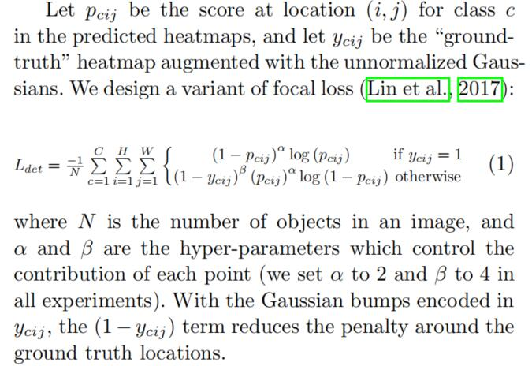

许多网络下采样层会获取全局信息并且降低内存消耗，(x,y)位置的像素被映射为(x/n,y/n)，而对其还原时，会存在一定精度上的损失，对IOU造成影响，因此，在对其remap到输入尺寸之前，预测位置偏移对角点的位置进行微调。

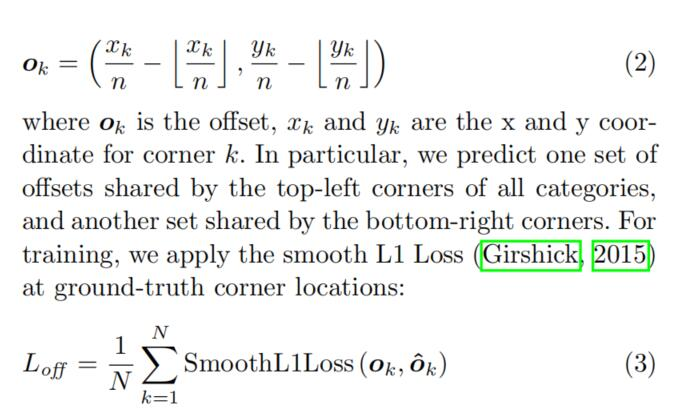

### Grouping Corners

一张图中可能会存在多个目标，因此，可能会检测到多组角点。这里需要确定，一组左上角及右下角的点是否是来自同一个边界框的。本文借鉴人体关键点检测中基于一组embeding 向量来确定是否将关键点进行组合，本文也预测了embeding vectors。通过，基于左上角点的embeding vectors及右下角点embeding vectors的距离来决定是否将两个点进行组合。重要的是二者之间的距离，而向量中的具体数值却不是很重要。本文使用1-D的embeding 向量，etk代表目标k左上角点的embeding ,ebk代表其右下角点的embeding。定义"pull"损失用于组合角点，“push”损失用于分离角点。如下，

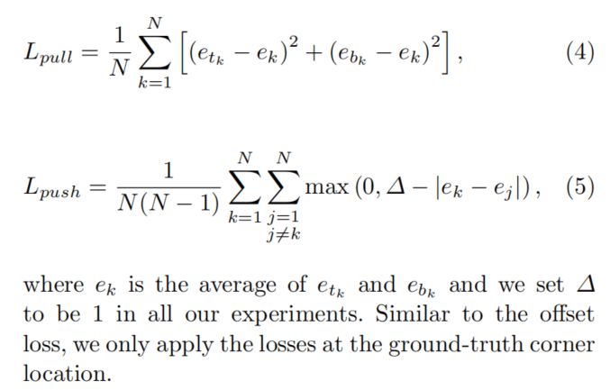

### Corner Pooling
角点的表示没有任何局部视觉信息，因此要确定一个像素是否为左上角的点，需要从框的顶部水平的向右观察，同时，在框的左边从下观察。提出了corner pooling基于先验以更好的对框进行定位。
假设判断(i,j)位置的像素是否为左上角的点，ft,fl为两个输入corner pooling 的feature maps，ftij,flij分别为feature map上（i,j）位置的向量。对于一个HxW的feature map，corner pool首先max pool,ft中(i,j)到(i,H)之间所有的特征向量得到向量tij,同理，max pool fl中（i,j）至(W,j)之间所有的特征向量得到向量lij，最后，将tij与lij进行相加操作。表达式如下，基于elementwise max 操作，右下角的定义同理，处理(0,j)->(i,j),(i,0)->(i,j)之间的特征向量。

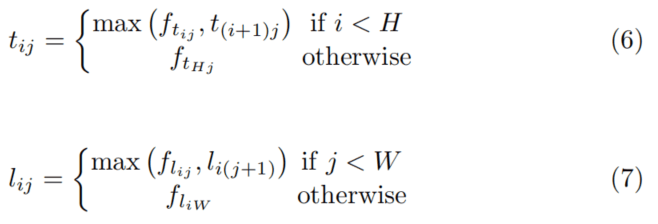

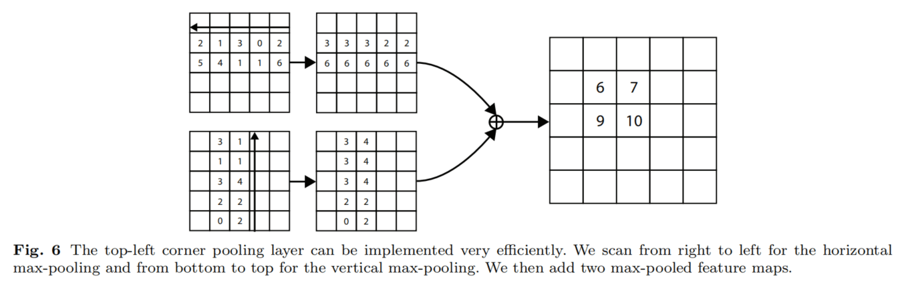

预测模型结构如下，模型的第一部分为修改的残差块，将第一个3x3的卷积替换为corner pooing,首先通过2个3x3x128的卷积核来处理来自backbone的feature map，后接一个corner pool层，将Pooled后的feature map送入3x3x256的conv-BN层中，同时增加了一个映射短链接，修正的残差块后接一个3x3x256的卷积及三个conv-BN-ReLU模块用于预测heatmaps,embedings,offsets。

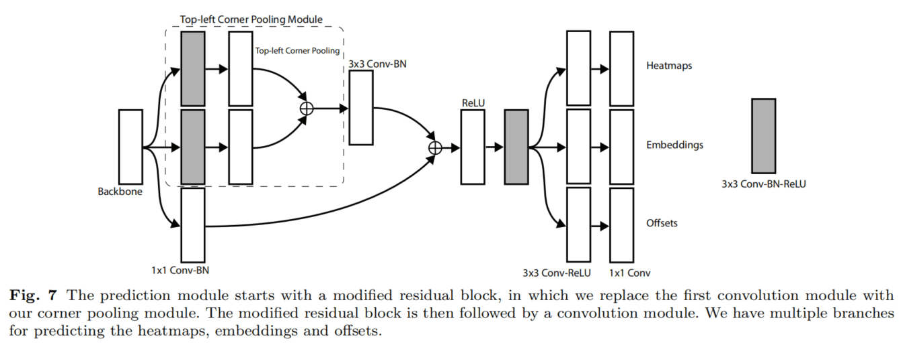

### Hourglass Network
CornerNet将Hourglass 网络作为backbone，Hourglass网络被首次用于人体姿态估计任务，包含多个hourglass模型，hourglass模型首先会对输入图片通过一系列卷积池化操作进行降采样，然后通过一系列上采样，反卷积等操作恢复至输入的分辨率。为了弥补最大池化过程中丢失的细节信息，增加了跳跃结构，来恢复上采样的细节信息。hourglass在单一结构中同时捕捉了局部及全局特征信息。当多个hourglass模型组合在一起时可以获得更高级别的特征信息。
本文的hourglass网络包含两个hourglass模块，并对其结构做了适当的更改。使用stride 2的卷积操作替换max pooling进行尺寸缩小，本文将分辨率减小5倍，通道数为{256，384，384，384，512}，在对特征进行上采样时，在最近的相邻上采样块中添加了两个残差模型。每个跳跃连接也由两个残差模型组成。在一个hourglass模型的中间存在四个残差模型，通道数为512，在hourglass模型之前，使用7x7x128,stride=2的卷积将输入分辨率降4倍。同时接一个stride 为2通道数为256的残差模块。
在训练过程中增加了中间监督，但其预测结果并未返回网络，因为对最终结果产生不良影响。在hourglass模型的输入及输出使用1x1的conv-BN模型，对结果通过后接ReLU及通道数为256的残差块进行像素级相加进行特征融合作为下一个hourglass的输入。hourglass网络的深度为104，只用网络的最后一层特征作预测。原始hourglass网络如下：

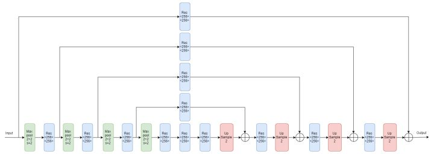

## result

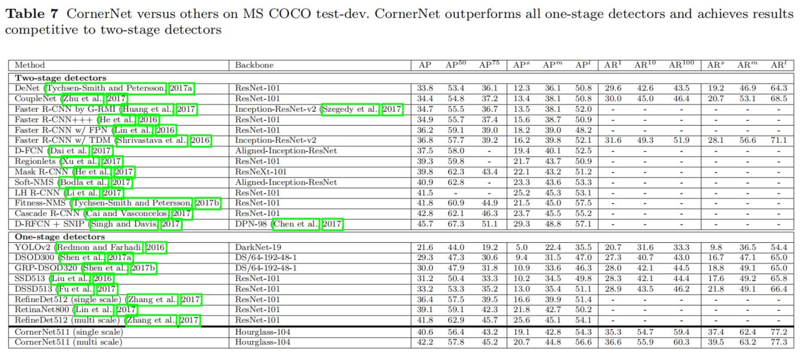

