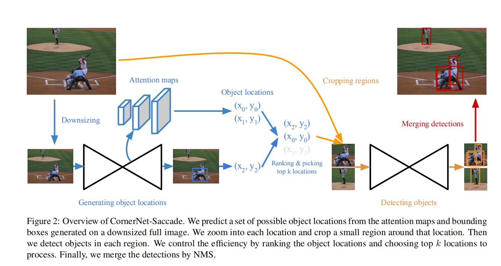

# CornerNet-Lite: Efficient Keypoint Based Object Detection

**paper:**[cornerNet_Lite](https://arxiv.org/abs/1904.08900) `CVPR2019`

**github:**[cornerNet_github](https://github.com/princeton-vl/CornerNet-Lite)

**论文笔记：**[解读](https://www.cnblogs.com/fourmi/p/10748245.html)

## Abstract
Keypoint-based methods are a relatively new paradigm in object detection, eliminating the need for anchor boxes and offering a simplified detection framework. Keypoint-based CornerNet achieves state of the art accuracy among single-stage detectors. However, this accuracy comes at high processing cost. In this work, we tackle the problem of efficient keypoint-based object detection and introduce CornerNet-Lite. CornerNet-Lite is a combination of two efficient variants of CornerNet: CornerNet-Saccade, which uses an attention mechanism to eliminate the need for exhaustively processing all pixels of the image, and CornerNet-Squeeze, which introduces a new compact backbone architecture. Together these two variants address the two critical use cases in efficient object detection: improving efficiency without sacrificing accuracy, and improving accuracy at real-time efficiency. CornerNet-Saccade is suitable for offline processing, improving the efficiency of CornerNet by 6.0x and the AP by 1.0% on COCO. CornerNet-Squeeze is suitable for real-time detection, improving both the efficiency and accuracy of the popular real-time detector YOLOv3 (34.4% AP at 34ms for CornerNet-Squeeze compared to 33.0% AP at 39ms for YOLOv3 on COCO). Together these contributions for the first time reveal the potential of keypoint-based detection to be useful for applications requiring processing efficiency.

基于关键点模式进行目标检测是一种新的方法，他并不需要依赖于anchor boxes，是一种精简的检测网络，但需要大量的预处理才能得到较高的准确率。本文提出CornerNet-Lite，是CornerNet两种变形的组合，一个是CornerNet-Saccade，基于attention机制，从而并不需要对图片中的每个像素做详尽的处理。另一个是CornerNet-Squeeze，引入了新的复杂的backbone结构。结合这两个变形可以应用到两个重要情景中：（1）在不降低准确率的情况下挺高效率，同时，在实时检测过程中提高了准确率，CornerNet-Saccade即适合做离线处理，也适用于实时的检测。

## Contributions
- We propose CornerNet-Saccade and CornerNet-Squeeze, two novel approaches to improving the efficiency of keypoint-based object detection.
提出两个网络模型：CornerNet-Scacade和CornerNet-Squeeze，两种新的方法都改进了基于关键点的对象检测的效率。

- On COCO, we improve the efficiency of state-of-the-art keypoint based detection by 6 fold and the AP from 42.2% to 43.2%.
在coco数据集上，CornerNet-Scacade网络与原始的CornerNet相比，Ap从42.2%提升了1个百分点到了43.2%，而速度为每张图片190ms，是原始网络的6倍。

- On COCO, we improve both the accuracy and efficiency of state-of-the artreal-time object detection (to 34.4% at 30ms from 33.0% at 39ms of YOLOv3).
在coco数据集上，CornerNet-Squeeze网络和yolov3相比，既提高了精确度又改进了速度，效果为Ap为34.4%，每张图片检测速度30ms，而yolov3的Ap为33.0%，每张图片检测速度为39ms。

## Ideal
The efficiency of any object detector can be improved along two orthogonal directions ：reducing the number of pixels processed and reducing the amount of processing per pixel。对于任意的对象检测器来说都可以通过两种方法来改进检测推理效率：①降低处理的像素的数目；②对于每个像素减少处理的次数。所以针对这两个方向提出了两个网络：CornerNet-Saccade及CornerNet-Squeeze，统称为CornerNet-Lite。

**CornerNet-Saccade：** It starts with a downsized full image and generates an attention map, which is then zoomed in on and processed further by the model. This differs from the original CornerNet in that it is applied fully convolutionally across multiple scales. By selecting a subset of crops to examine in high resolution, CornerNetSaccade improves speed while improving the accuracy。
CornerNet-Saccade网络以降低处理的像素数目的方法来改进检测效率。使用了attention注意力机制。首先对整个图片进行下采样，然后生成attention map，然后在后续模型中进行缩放并进一步处理。这与原始的CornerNet是有区别的，原始的CornerNet在不同尺度上使用全卷积，而该网络中，通过选择一系列高分辨率的裁剪图来提高效率及准确率。

**CornerNet-Squeeze：** It incorporates ideas from SqueezeNet and MobileNets , and introduces a new, compact hourglass backbone that makes extensive use of 1×1 convolution, bottleneck layer, and depth-wise separable convolution.
CornerNet-Squeeze网络通过减少每个像素的处理过程来改进效率,它结合了SqueezeNet及MobileNet的思想，同时，引入了一个新的简洁的主干网络hourglass，利用了1x1的卷积,bottleneck层及深度分离卷积。

in CornerNet-Saccade are single-type and multi-object, in that there is a single type of crop processing and each crop can produce multiple objects at once without additional subcrops. This means that the number of crops processed by CornerNet-Saccade can be much smaller than the number of objects, whereas for R-CNN variants and AutoFocus the number of crops must be no smaller than the number of objects。（The saccades in all these RCNN variants are thus single-type and single-object, in that there is a single type of processing of crops, and each crop produces at most a single object.）（The saccades in AutoFocus are thus multitype and mixed, in the sense that two different types of processing are interleaved.）
CornerNet-Saccade网络单类型多对象，对于裁剪的处理是单类型，然后每一个裁剪可以一次产生多个对象而不增加子裁剪。这意味着CornerNet-Saccade网络裁剪处理的数目将比对象的数目小很多，而RCNN的各种边形和AutoFocus网络的裁剪过程数目一定不会比对象的数目少。（RCNN变形的各种网络的加速是单类型单对象的，裁剪的每一个过程是一个类型，然后每个裁剪的区域最多产生一个对象（可能没有对象，即是背景）。）

## CornerNet-Saccade
 It uses the downsized full image to predict attention maps and coarse bounding boxes; both suggest possible object locations. CornerNet-Saccade then detects objects by examining the regions centered at the locations in high resolution.It can also trade accuracy with efficiency by controlling the maximum number of object locations to process per image. An overview of the pipeline is shown in figure。
 
 CornerNet-Saccade在可能存在目标物proposal的小区域范围内进行目标检测。网络首先将整个图片进行下采样，然后再预测attention map和粗糙的边界框，它们两个都可以大致给出对象的位置。CornerNet-Saccade然后会通过在高分辨率图片上检测该区域的中心进而检测到目标对象。通过控制每张图片处理的最大数量的目标对象的位置来达到准确率及效率的权衡。

- 通过下采样到两种尺度：图像的最长边为255像素或者192像素。然后192像素再以边界填充为0的方式填充为255像素，这样它们就可以平行处理。降低分辨率有两个原因：（1）这样操作会减少inference时间上的消耗（2）网络可以很容易得到图片中的上下文信息进而进行attention maps的预测。

- 对于已经得到的下采样的图片，CornerNet-Saccade预测3张attention maps，一个用来检测小物体，一个检测中物体，一个检测大物体。我们认定：如果对象的边界框的最长边小于32像素则认为是小物体；如果在32到96像素之间则认为是中物体；如果大于96像素则认为是大物体。针对不同尺寸的物体的位置进行独立的预测，可以更好的控制CornerNet-Saccade对每个位置的扩大（zoom in）程度。

使用不同的特征图（feature maps）来生成attention maps，而特征图从CornerNet-Saccade网络的主干网络（漏斗网络 hourglass network）中得到。在网络中的每一个hourglass模块都使用一些卷积和下采样层来downsize输入的特征图。然后通过多个卷积和上采样层将这些特征图进行上采样回原先输入的分辨率大小。从上采样层得到的特征图用来预测attention maps。我们通过使用3×3卷积-Relu模块跟着一个1×1卷积-sigmoid模块对每一个特征图预测attention maps。在测试过程中，只处理分数大于0.3的位置。

 当CornerNet-Saccade处理下采样后的图片，极有可能会检测到一些目标物，同时，产生一些边界框，单由于分辨率较低，因此，这些框可能并不是很准确，因此，需要在高分辨率上进行评估，进而得到更好的边界框。
 
 - 对于从attention maps得到的位置，可以针对不同尺寸的目标设置不同的放大尺寸：Ss代表小目标的缩放尺寸，Sm代表中等目标的缩放尺寸，Sl代表大目标的缩放尺寸。整体三者之间存在一种关系，Ss>Sm>sl，因为，我们需要对小目标进缩放的程度要大一些。本文设置如下,Ss=4,sm=2,sl=1.对于可能存在的位置(x,y)，根据大致的目标尺寸，按照si的比例对downsized图片进行放大,i in {s,m,l},然后，将CornerNet-Saccade应用到255x255窗口的中心位置处。

    从预测的边界框中得到的位置包含更多目标物的尺寸信息。可以利用得到的边界框的尺寸来确定缩放大小。确定缩放比例后，使缩放后的小目标的长边为24，中等目标的为64，大目标的为192。

### backbone network

新的hourglass网络包含3个hourglass模块，并且深度只有54层。而原始的CornerNet有2个hourglass模块，而深度为104层。我们把新的网络称为hourglass-54。hourglass-54中的每一个hourglass模块相比于hourglass-104有更少的参数和更浅的层。本文将feature 下采样2倍，然后在每个下采样层的后面用了一个残差层及跳跃结构。每一个hourglass模块下采样3次并且以（384,384,512）的方式增加通道数。在hourglass模型的中部有一个通道数为512的残差模块，同时，在上采样的每一层后面都有一个残差模块。而在hourglass模块之前将图像downsize两次。

## CornerNet-Squeeze

CornerNet-Squeeze提出了一个策略来降低网络的复杂度：（1）将3×3的卷积核替换为1×1.（2）降低输入通道为3×3的卷积核（3）晚点进行下采样。
SqueezeNet 中的构建模块 — fire module，封装了前两个策略。Fire module 首先通过由 1×1 滤波器组成的 squeeze 层降低输入通道数。然后将结果通过由 1×1和3×3 滤波器混合组成的 expand 层。基于 SqueezeNet 的想法，我们在 CornerNet-Squeeze 中使用了 fire module，没有用残差模块。而且，受 MobileNet 的启发，我们将第二层中的标准 3×3 卷积替换为 3×3 深度可分离卷积，这进一步加快了推理速度。下图展示了 CornerNet 的残差模块和 CornerNet-Squeeze 中的 fire module 对比细节。

除了替换残差模块还做了其他一些改进，在 Hourglass 模块之前增加了一个下采样层，以此降低 Hourglass 模块特征图的最大分辨率，并且在每个 Hourglass 模块内去掉了一个下采样层。CornerNet-Squeeze 在 Hourglass 模块前相应地将图像 downsizes the image three times，但是 CornerNet 仅将图像尺寸downsizes the image twice。我们在 CornerNet 的预测模块中，将 3×3 滤波器替换为 1×1 滤波器。最后，我们将 Hourglass 网络中的 nearest neighbor 上采样替换为了 4×4 卷积核的反卷积 (transpose convolution)。

