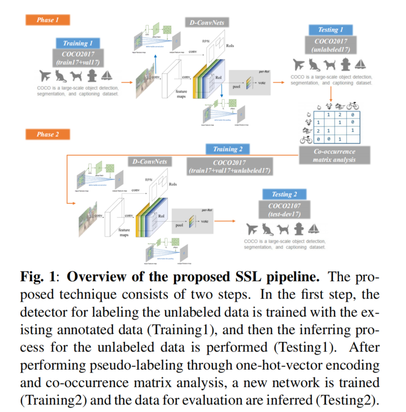
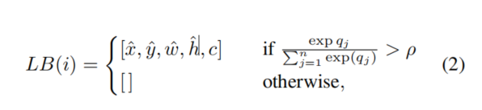
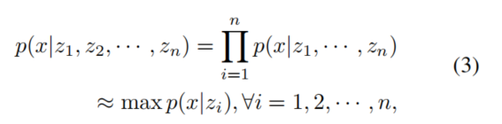
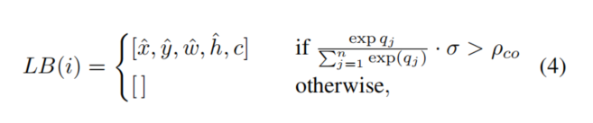
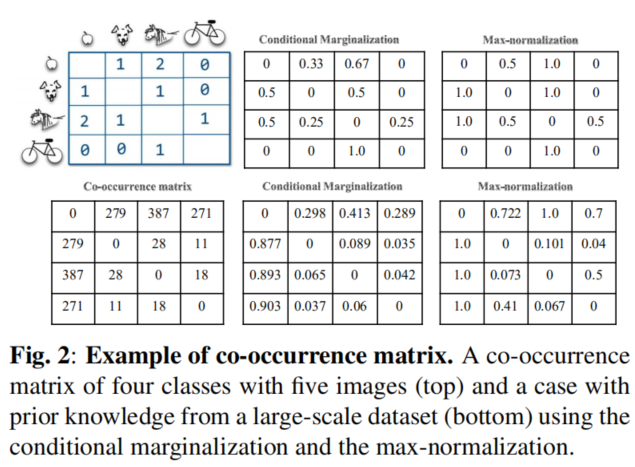
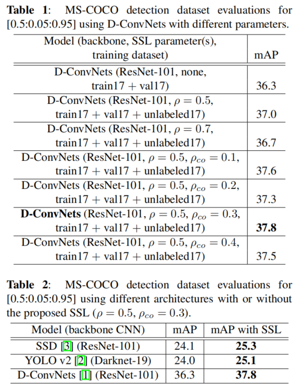

# Co-occurrence matrix analysis-based semi-supervised training for object detection

**paper:**[SSL](https://arxiv.org/abs/1802.06964)

## Abstract

在使用卷积神经网络（CNN）训练对象识别网络中，最重要的因素之一是提供伴随人类判断的注释数据。特别地，在对象检测或语义分割中，注释过程需要大量的人力。在本文中，我们提出了一种基于半监督学习（SSL）的对象检测训练方法，该方法通过应用先前从带注释的数据集中训练的网络来利用未带注释的数据的自动标记。由于受过训练的网络预测出的标签取决于前面学习到的参数，因此用它预测的伪标签再重新训练网络通常毫无意义。为了将有价值的伪标签转移到未标签数据，我们提出了一种基于共现矩阵分析的重新对齐方法，该方法考虑了估计标签的one-hot encoding和图像中对象之间的相关性。我们使用MS-COCO检测数据集来验证所提出的SSL方法和可变形神经网络（D-ConvNets）作为基本训练的目标检测器的性能。可以通过建议的SSL方法提高现有检测器（DConvNets，YOLO v2和SSD））的性能，而无需使用其他模型参数或修改网络体系结构。

## Contribution

我们提出了一种基于SSL（semi-supervised learning）思想的简单但功能强大的one-hot-vector编码，并通过共现矩阵分析提出了一种半监督训练方法。

- 预测的结果编码成 one-hot-vector
- 从先验知识中获得的共现矩阵用来重新计算预测的伪标签是否用来重新训练。（选择合适的伪标签来作为重新训练的数据）

## Related work

### 用 one-hot-vector 编码的伪标签

为了使用伪标签啊重新训练网络，把 D-ConvNets 的softmax输出高于阈值的预测的边界框编码成 one-hot-vector 作为后续的重新训练。

LB(·)是用来训练标签的序号字典，形式是 [x,y,w,h,c] 的向量。i是在预测的图片中第i个新的标注对象，添加到原先的标注数据集中。c是对应的softmax输出的结果类别。qj是D-ConvNets的最后一层预测响应，n是给定的数据集中检测的类的总数目。如果超过给定的阈值ρ，则把这个伪标签添加到原先的标注数据集中用来未来的再训练。

### 共现矩阵分析

共现矩阵是通过已经标注的先验知识数据中提取出来的，它代表同一张图片中对象出现的可能性。由于仅学习对象检测器来推断特定对象的存在概率在训练结果上存在偏差，因此有效表示与同现对象的关系以重新调整推断概率并将其用于伪标记。

为了在构造共现矩阵时可以以计算的形式表示对象之间的关系，假定对象之间的条件独立性。 然后，为了归一化图像中对象之间的强关系，执行了最大归一化。 最后，为了在最大归一化之后有效地将信息应用于先验知识，**当图像中同时存在多个对象时，仅将两个最强对象之间的关系应用于最终softmax输出校正**。

其中n是要检测的类的总数。 例如，如果要在图像中检测到四个类别的所需对象（请参见图2），则可以应用等式3中的规则来提取类别为apple的同现概率，如下所示：p（apple | dog，horse ，自行车）≈p（苹果|马）。 为了反映提取的校正概率，我们需要重新缩放推断的softmax概率，以便使用共现矩阵值进行伪标记。 在这种情况下，如下定义对在等式2中应用了共现阈值的未标记数据的标记。

结合上式，把 one-hot-vector 中的等式（2）变成如形上式，其中σ = max p(x|zi)是来自共现矩阵的所需类对象的概率；ρco是伪标记的阈值，与等式2相同，后者应用一热向量编码并推断出输出。

Co-occurrence 矩阵构建过程可以参考[简单频率统计](https://github.com/hbkooo/Paper/tree/master/HBK/OD_meet_knowledgeGraph#semantic-consistency-%E8%AF%AD%E4%B9%89%E4%B8%80%E8%87%B4%E6%80%A7)，即记录两个目标共同出现在同一张图像中的次数来构建，所以得到的共现矩阵是对称阵。然后将矩阵按行求占比，mij = mij/sum(mi)；然后进行按行[最大值归一化](https://blog.csdn.net/xiaotao_1/article/details/79077293)。

### Experiment

 

