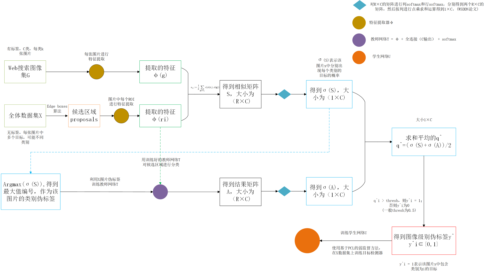

# Training Object Detectors from Few Weakly-Labeled and Many Unlabeled Images

**paper:**[weakly-labeled detector](https://arxiv.org/abs/1912.00384)

## Method

### problem
大量的图像集X，没有任何的标签信息，其中每张图像中包含一个或者多个对象目标，类别是C类中的一类。然后对每个类别，通过类别名字在网上搜索收集K张图片，K小于等于20。所以也就是说，有一个支撑数据集G（从网上搜索收集的包含C类标签的图像级别标签的图像），还有一些什么标注信息都没有的图像集X。用这些数据和一个预训练的分类网络特征提取器，来学习一个检测器来定位和分类新的图像中的对象目标。

### Motivation
问题涉及到弱监督的检测和半监督的分类。

### Method overview

该方法的流程如上图所示。通过网络图像搜索收集数据集G；然后在基准数据集X上推理图像水平的类的可能性。尤其，我们提取数据集X的图像中的目标候选框（proposals），并将从特征提取器φ中提取的区域级特征与数据集G中的图像的全局特征进行比较。我们通过将这些相似性传播到图像级别来估计X中图像上的类概率（阶段1）。我们在X上推断伪标签，并在 C 分类任务上训练从特征提取器 φ 继承的教师网络T（阶段2）。微调的网络 T 用来分类X的图像中的候选区域，得到新的图像级别的类标签概率（阶段3），我们将其与在阶段1中从G中获得的结果进行平均。最后我们提取 X 上的多类别伪标签，并训练学生网络 U 通过PCL的弱监督的检测任务。

### 步骤
- 收集网络图像（支撑集 G ）
- 对基准及X推理类概率
对数据集X中的每一张图像x，使用[edge boxes](https://pdollar.github.io/files/papers/ZitnickDollarECCV14edgeBoxes.pdf)来提取一个R个目标候选区域（proposals）的集合。只通过集合G很难给每一个候选区域一个准确的标签，所以理想中的通过候选区域训练一个目标检测器不太现实。反而，受到[WSDDN](https://www.robots.ox.ac.uk/~vgg/publications/2016/Bilen16/bilen16.pdf)（[笔记](https://blog.csdn.net/djh123456021/article/details/84393098)）的启发，我们对整张图像x预测类概率。

然后对x中的每一个候选区域提取特征 φ(r)，对G中的每一个图像g提取特征 φ(g)，然后定义一个 R×C 的相似矩阵 S = {Sij}：其中i是第 i 个候选区域，j是类别j。  

对于得到的R×C矩阵，分别进行行的softmax和列的softmax，得到两个 R×C 的矩阵，如下所示： σcls(S)中的第i行表示对于候选区域ri，分别属于某一类别的概率；σdet(S)中的每一列表示对于每一个类别j，所有的候选区域分别的概率。

最后得到 σ(S) 通过 σcls(S) 和 σdet(S) 的按列内积和得到， σ(S)j表示在图像x中出现目标j的概率。 

- 教师和学生网络的训练

通过上面的步骤，我们可以得到图像集X中的每一张图像的类概率向量（即某张图像中存在目标类别j的概率是多少）。下一步就是把它们转化为多类别的伪标签并直接利用弱监督检测任务训练一个学生网络。过程是我们首先使用教师网络将支撑集G中的知识提取到基准及X中，然后从教师网络中提取这些知识到学生网络中。

教师网络T是使用特征提取网络 φ 然后后面跟着随机初始化的 C 输出的全连接层和 softmax。然后我们在 X 上的 C 分类任务上微调 T。对于上面求得的σ(S) 是图片x中的类概率，我们取 σ(S) 中的最大值的序号 j 作为伪标签。然后我们用这个伪标签通过标准的交叉损失来微调 T。

微调的教师网络 T 已经编码了X中的对象信息到网络参数中。这里不能直接把 T 预测的图像级别的标签到学生网络中。相反，我们使用 T 来直接分类X中的每一个目标候选框（proposals）。

给定一张X中的输入图像x，我们收集教师网络 T 的输出类概率 R×C 的矩阵A，其中aij表示候选区域ri是类j的概率。通过上面公式（3）中，我们可以同样得到 新的图像级别的类概率 σ(A)。 T是在X上训练的分类器，而 σ(S) 是由 G训练的分类器得到的结果，所以我们可以把这两个结果进行合并取平均。 

通过上面得到的 q 我们可以得到图像级别的伪标签 y^ ∈{0,1}C，其中y^j = 1 表明类别j的对象出现在图像中，此处我们可以设置阈值为0.5，来根据 q^ 得到 y^，即如果 q^j >= 0.5，则 y^j = 1.

最后通过得到的这些伪标签被用来训练一个目标检测器，使用弱监督的检测pipeline。尤其，我们训练学生网络使用基于PCL方法的弱监督检测器。

根据我自己的理解画的流程图如下图所示。

